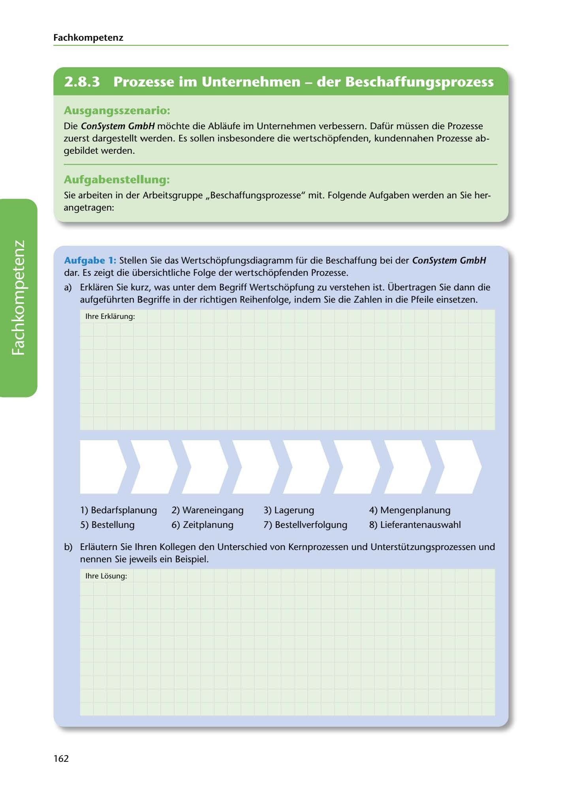

---
## Page 164
---

Fach kom petenz

<!-- IMAGE: page-164-img-1.jpeg - TODO: Add description -->

**[VISUAL: CONSYSTEM GMBH SCENARIO HEADER]**
Header image for the ConSystem GmbH procurement process optimization scenario.

## Ausgangsszenario:

Die ConSystem GmbH mochte die Ablaufe im Unternehmen verbessern. Dafür müssen die Prozesse zuerst dargestellt werden. Es sollen insbesondere die wertschopfenden, kundennahen Prozesse ab- gebildet werden.

## Aufgabenstellung:

Sie arbeiten in der Arbeitsgruppe ,,Beschaffungsprozesse" mit. Folgende Aufgaben werden an Sie her- angetragen:

Aufgabe 1: Stellen Sie das Wertschopfungsdiagramm für die Beschaffung bei der ConSystem GmbH dar. Es zeigt die übersichtliche Folge der wertschopfenden Prozesse.

a) Erklaren Sie kurz, was unter dem Begriff Wertschopfung zu verstehen ist. Übertragen Sie dann die

aufgeführten Begriffe in der richtigen Reihenfolge, indem Sie die Zahlen in die Pfeile einsetzen.

lhre Erklarung:

**[VISUAL: ANSWER SPACE]**
Blank lined area for students to explain the concept of value creation (Wertschöpfung).

**[VISUAL: VALUE CHAIN DIAGRAM - PROCUREMENT PROCESS]**
A sequential arrow diagram with 8 empty positions for students to arrange the procurement process steps in correct order: 1) Bedarfsplanung, 2) Wareneingang, 3) Lagerung, 4) Mengenplanung, 5) Bestellung, 6) Zeitplanung, 7) Bestellverfolgung, 8) Lieferantenauswahl.

1) Bedarfsplanung 2) Wareneingang 3) Lagerung 4) Mengenplanung

5) Bestellung 6) Zeitplanung 7) Bestellverfolgung 8) Lieferantenauswahl

b) Erlautern Sie lhren Kollegen den Unterschied von Kernprozessen und Unterstützungsprozessen und

nennen Sie jeweils ein Beispiel.

lhre Losung:

162
