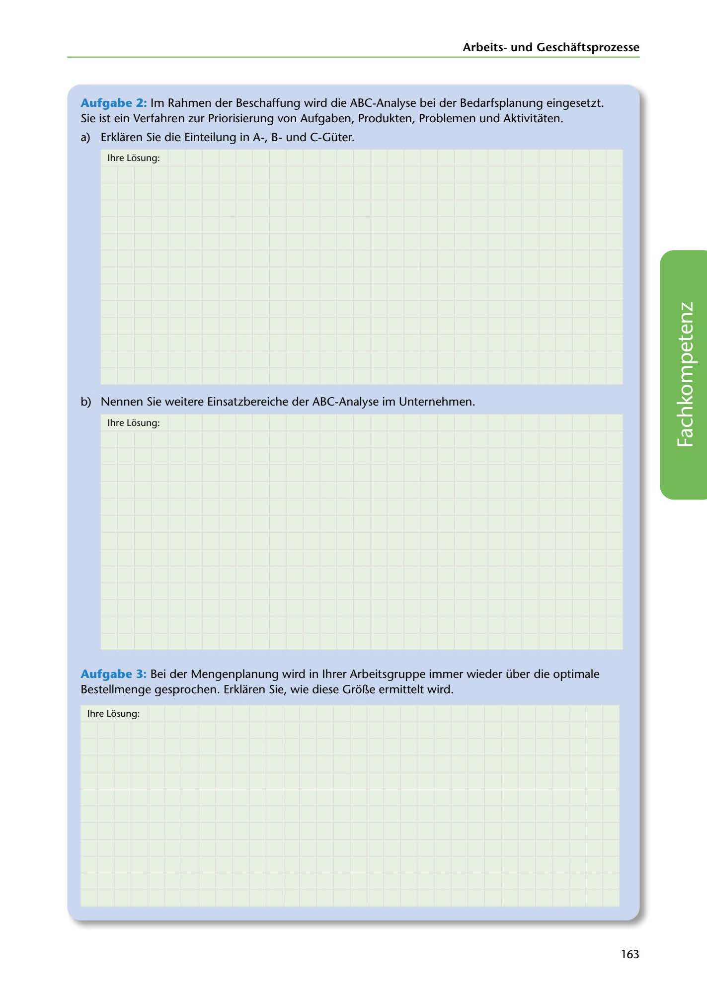

---
## Page 165
---

Arbeitsund Geschaftsprozesse

Aufgabe 2: lm Rahmen der Beschaffung wird die ABC-Analyse bei der Bedarfsplanung eingesetzt. Sie ist ein Verfahren zur Priorisierung von Aufgaben, Produkten, Problemen und Aktivitaten.

a) Erklaren Sie die Einteilung in A-, Bund C-Güter.

lhre Losung:

b) Nennen Sie weitere Einsatzbereiche der ABC-Analyse im Unternehmen.

lhre Losung:

<!-- IMAGE: page-165-img-1.jpeg - TODO: Add description -->

Aufgabe 3: Bei der Mengenplanung wird in lhrer Arbeitsgruppe immer wieder über die optimale Bestellmenge gesprochen. Erklaren Sie, wie diese Gr6Be ermittelt wird.

lhre Losung:

163
