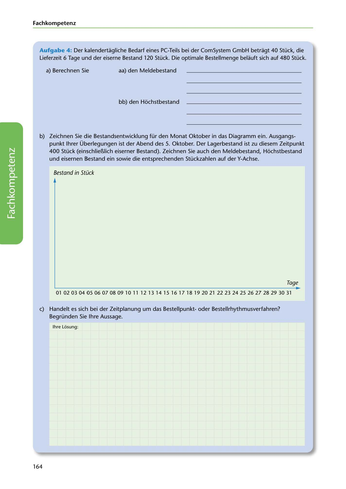

---
## Page 166
---

### Fach kom petenz

Aufgabe 4: Der kalendertagliche Bedarf eines PC-Teils bei der ComSystem GmbH betragt 40 Stück, die Lieferzeit 6 Tage und der eiserne Bestand 120 Stück. Die optimale Bestellmenge belauft sich auf 480 Stück.

a) Berechnen Sie aa) den Meldebestand

bb) den Hochstbestand

b) Zeichnen Sie die Bestandsentwicklung für den Monat Oktober in das Diagramm ein. Ausgangs- punkt lhrer Überlegungen ist der Abend des 5. Oktober. Der Lagerbestand ist zu diesem Zeitpunkt 400 Stück (einschliel1Iich eiserner Bestand). Zeichnen Sie auch den Meldebestand, Hochstbestand

und eisernen Bestand ein sowie die entsprechenden Stückzahlen auf der Y-Achse.

Bestand in Stück

<!-- IMAGE: page-166-img-1.jpeg - TODO: Add description -->

Tage

010203 04 05 06 07 08 0910 111213 1415 16 1718 19 20 21 2223 24 25 26 27 28 29 30 31

e) Handelt es sich bei der Zeitplanung um das Bestellpunktoder Bestellrhythmusverfahren? Begründen Sie lhre Aussage.

lhre Losung:

164
