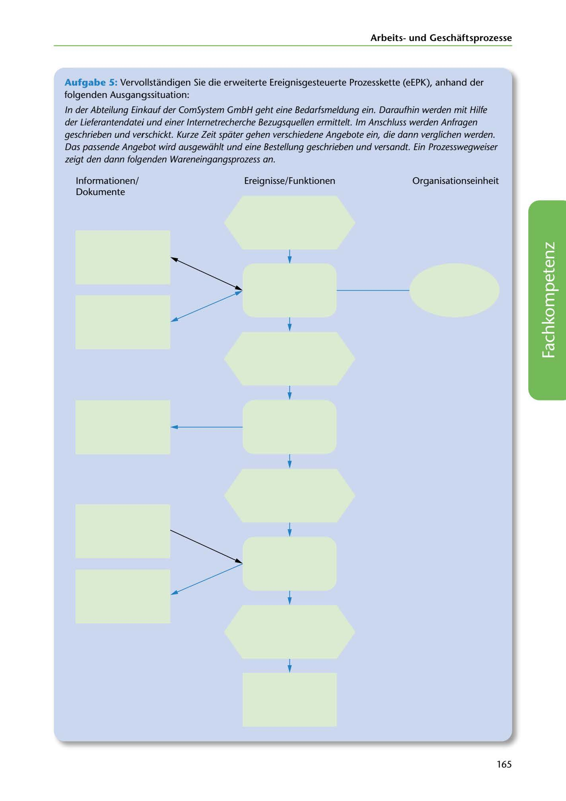

---
## Page 167
---

### Arbeitsund Geschaftsprozesse

Aufgabe 5: Vervollstandigen Sie die erweiterte Ereignisgesteuerte Prozesskette (eEPK), anhand der folgenden Ausgangssituation:

In der Abteilung Einkauf der ComSystem GmbH geht eine Bedarfsmeldung ein. Daraufhin werden mit Hilfe der Lieferantendatei und einer lnternetrecherche Bezugsquellen ermittelt. lm Ansch/uss werden Anfragen geschrieben und verschickt. Kurze Zeit spdter gehen verschiedene Angebote ein, die dann verglichen werden.

Das passende Angebot wird ausgewdhlt und eine Bestellung geschrieben und versandt. Ein Prozesswegweiser zeigt den dann folgenden Wareneingangsprozess an.

1 nformationen/ Dokumente Ereignisse/Funktionen Organisationseinheit

<!-- IMAGE: page-167-img-1.jpeg - TODO: Add description -->

**[VISUAL: EXTENDED EVENT-DRIVEN PROCESS CHAIN (eEPK) TEMPLATE]**
A blank extended Event-driven Process Chain (eEPK) template with three columns: Informationen/Dokumente (left), Ereignisse/Funktionen (center), and Organisationseinheit (right). Students must complete the procurement process flow showing: demand notification receipt → supplier identification using supplier database and internet research → inquiry creation and sending → offer receipt → offer comparison → order placement → handover to goods receipt process.

**[VISUAL: eEPK SYMBOL LEGEND]**
Legend showing the standard eEPK notation symbols used in the diagram template.

165
