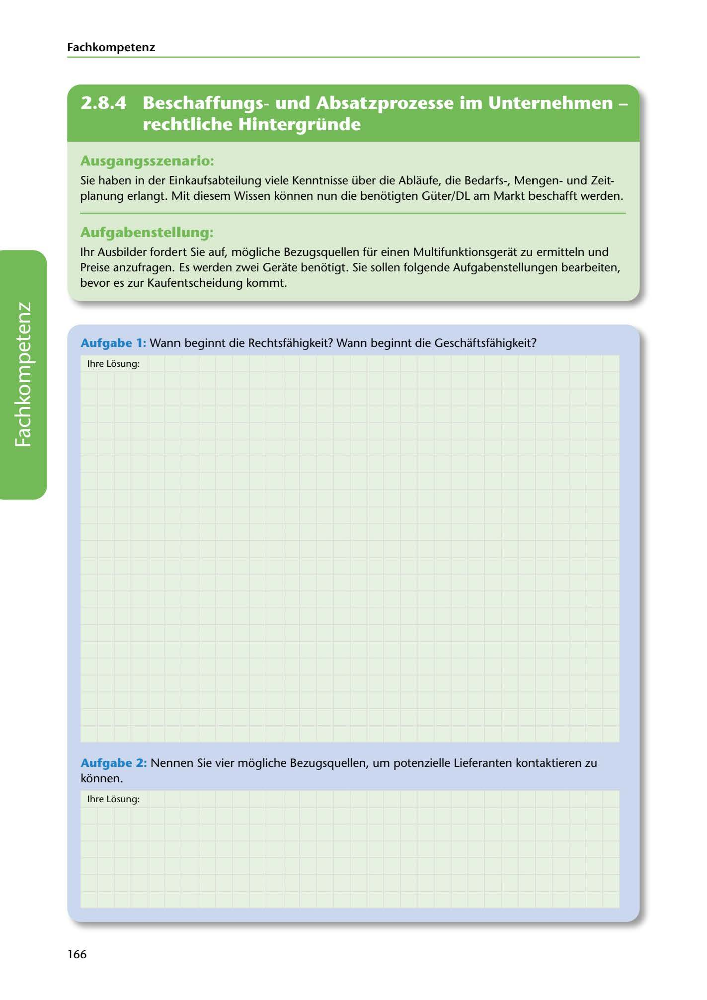

---
## Page 168
---

Fach kom petenz

<!-- IMAGE: page-168-img-1.jpeg - TODO: Add description -->

**[VISUAL: CONSYSTEM GMBH SCENARIO HEADER]**
Header image for the ConSystem GmbH procurement and purchasing scenario.

## Ausgangsszenario:

Sie haben in der Einkaufsabteilung viele Kenntnisse über die Ablaufe, die Bedarfs-, Mengenund Zeit- planung erlangt. Mit diesem Wissen konnen nun die benotigten Güter/DL am Markt beschafft werden.

## Aufgabenstellung.

1hr Ausbilder fordert Sie auf, mogliche Bezugsquellen für einen Multifunktionsgerat zu ermitteln und Preise anzufragen. Es werden zwei Gerate benotigt. Sie sallen folgende Aufgabenstellungen bearbeiten, bevor es zur Kaufentscheidung kommt.

Aufgabe 1: Wann beginnt die Rechtsfahigkeit? Wann beginnt die Geschaftsfahigkeit?

lhre Losung:

**[VISUAL: ANSWER SPACE]**
Blank lined area for students to explain when legal capacity (Rechtsfähigkeit) and business capacity (Geschäftsfähigkeit) begin.

Aufgabe 2: Nennen Sie vier mogliche Bezugsquellen, um potenzielle Lieferanten kontaktieren zu konnen.

lhre Losung:

166
