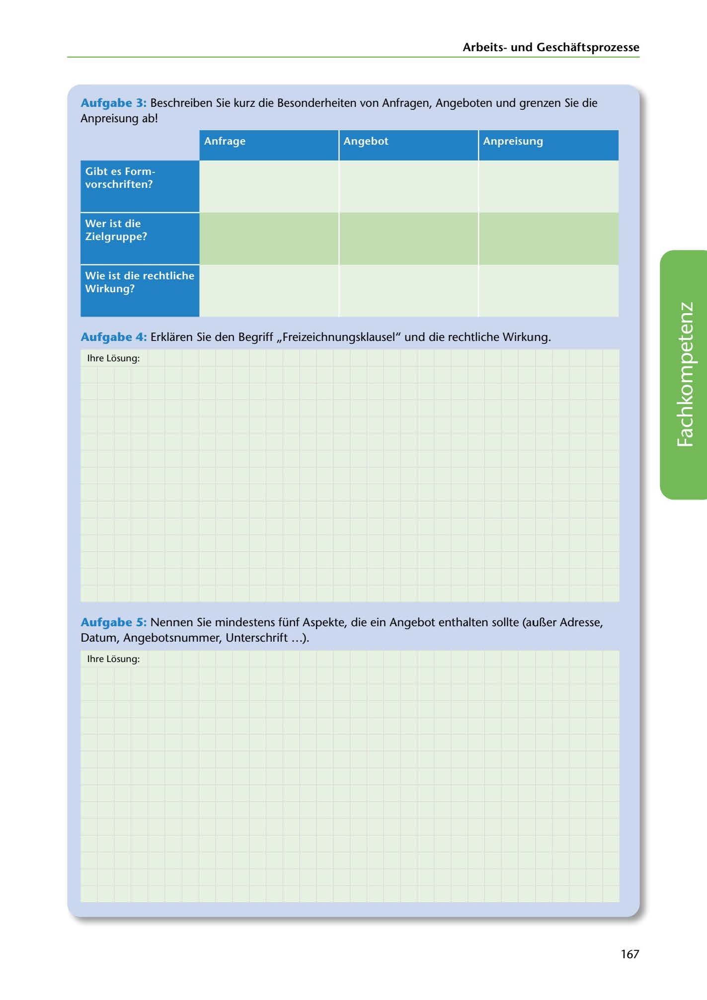

---
## Page 169
---

Arbeitsund Geschaftsprozesse

Aufgabe 3: Beschreiben Sie kurz die Besonderheiten von Anfragen, Angeboten und grenzen Sie die Anpreisung ab!

Angebot Anpreisung

<!-- IMAGE: page-169-img-1.jpeg - TODO: Add description -->

**[VISUAL: OFFER VS ADVERTISEMENT COMPARISON TABLE]**
A comparison table with rows for "Wer ist die Zielgruppe?" (target audience) and "Wie ist die rechtliche Wirkung?" (legal effect) to distinguish between binding offers (Angebot) and non-binding advertisements (Anpreisung).

Wer ist die Zielgruppe?

Wie ist die rechtliche Wirkung?

Aufgabe 4 : Erklaren Sie den Begriff ,, Freizeichnungsklausel" und die rechtliche Wirkung.

lhre Losung:

**[VISUAL: ANSWER SPACE]**
Blank lined area for students to explain the concept of disclaimer clauses (Freizeichnungsklausel) and their legal implications.

Aufgabe 5: Nennen Sie mindestens fünf Aspekte, die ein Angebot enthalten sollte (aur:i.er Adresse, Datum, Angebotsnummer, Unterschrift ... ).

lhre Losung:

167
