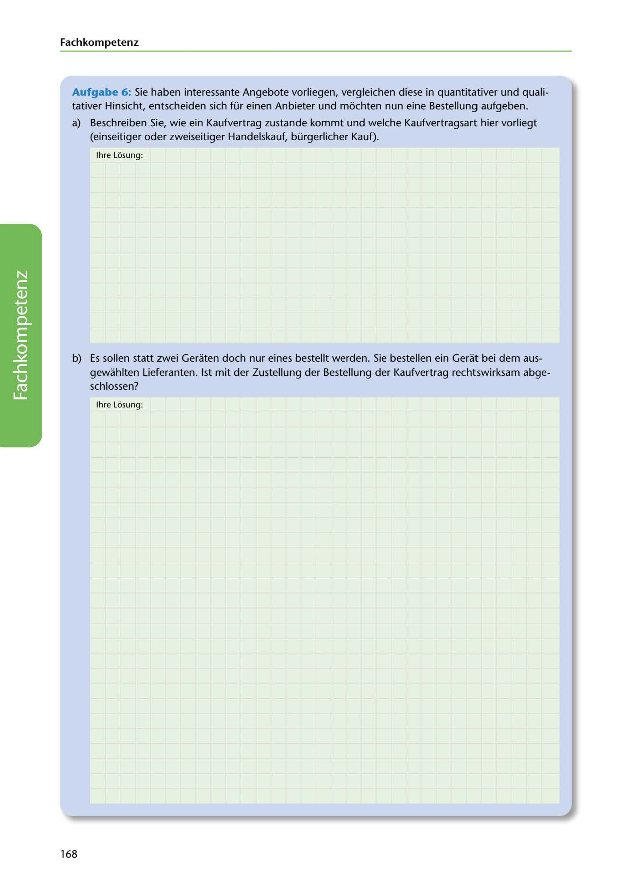

---
## Page 170
---

### Fach kom petenz

Aufgabe 6: Sie haben interessante Angebote vorliegen, vergleichen diese in quantitativer und quali- tativer Hinsicht, entscheiden sich für einen Anbieter und mochten nun eine Bestellung aufgeben.

a) Beschreiben Sie, wie ein Kaufvertrag zustande kommt und welche Kaufvertragsart hier vorliegt (einseitiger oder zweiseitiger Handelskauf, bürgerlicher Kauf).

lhre Losung:

b) Es sollen statt zwei Geraten doch nur eines bestellt werden. Sie bestellen ein Gerat bei dem aus-

gewahlten Lieferanten. 1st mit der Zustellung der Bestellung der Kaufvertrag rechtswirksam abge- schlossen?

lhre Losung:

<!-- IMAGE: page-170-img-1.jpeg - TODO: Add description -->

168
