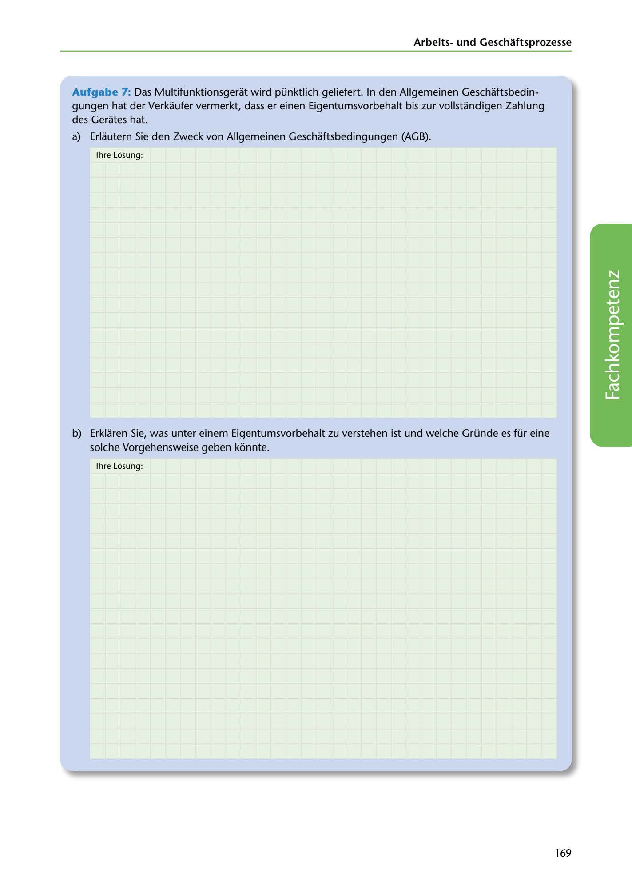

---
## Page 171
---

Arbeitsund Geschaftsprozesse

Aufgabe 7: Das Multifunktionsgerat wird pünktlich geliefert. In den Allgemeinen Geschaftsbedin- gungen hat der Verkaufer vermerkt, dass er einen Eigentumsvorbehalt bis zur vollstandigen Zahlung des Gerates hat.

a) Erlautern Sie den Zweck von Allgemeinen Geschaftsbedingungen (AGB).

lhre Losung:

<!-- IMAGE: page-171-img-1.jpeg - TODO: Add description -->

b) Erklaren Sie, was unter einem Eigentumsvorbehalt zu verstehen ist und welche Gründe es für eine solche Vorgehensweise geben konnte.

lhre Losung:

169
