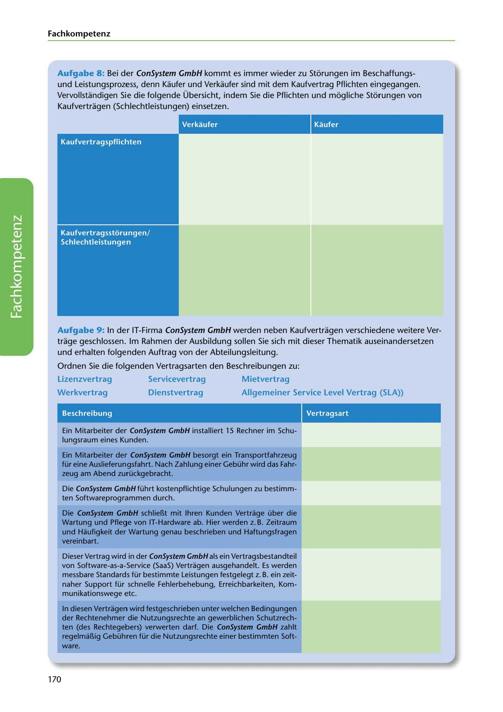

---
## Page 172
---

Fach kom petenz

Aufgabe 8: Bei der ConSystem GmbH kommt es immer wieder zu Storungen im Beschaffungs- und Leistungsprozess, denn Kaufer und Verkaufer sind mit dem Kaufvertrag Pflichten eingegangen. Vervollstandigen Sie die folgende Übersicht, indem Sie die Pflichten und mogliche Storungen von

Kaufvertragen (Schlechtleistungen) einsetzen.

1

Kaufer

<!-- IMAGE: page-172-img-1.jpeg - TODO: Add description -->

**[VISUAL: BUYER-SELLER OBLIGATIONS AND CONTRACT DISRUPTIONS DIAGRAM]**
A structured diagram showing the buyer (Käufer) and seller (Verkäufer) with their respective contractual obligations and potential disruptions (Störungen/Schlechtleistungen). Students must fill in the obligations (e.g., payment, delivery) and possible contract breaches (e.g., late payment, defective goods, delayed delivery).

Aufgabe 9: In der IT-Firma ConSystem GmbH werden neben Kaufvertragen verschiedene weitere Ver- trage geschlossen. lm Rahmen der Ausbildung sollen Sie sich mit dieser Thematik auseinandersetzen und erhalten folgenden Auftrag von der Abteilungsleitung.

Ordnen Sie die folgenden Vertragsarten den Beschreibungen zu:

### Mietvertrag

### Lizenzvertrag

### Servicevertrag

### Werkvertrag

### Dienstvertrag

### Allgemeiner Service Level Vertrag (SLA))

Beschreibung

Vertragsart

Ein Mitarbeiter der ConSystem GmbH installiert 15 Rechner im Schu- lungsraum eines Kunden.

Ein Mitarbeiter der ConSystem GmbH besorgt ein Transportfahrzeug für eine Auslieferungsfahrt. Nach Zahlung einer Gebühr wird das Fahr- zeug am Abend zurückgebracht.

Die ConSystem GmbH führt kostenpflichtige Schulungen zu bestimm- ten Softwareprogrammen durch.

### vereinbart.

Die ConSystem GmbH schlieBt mit lhren Kunden Vertrage über die Wartung und Pflege von IT-Hardware ab. Hier werden z. B. Zeitraum und Haufigkeit der Wartung genau beschrieben und Haftungsfragen

Dieser Vertrag wird in der ConSystem GmbH als ein Vertragsbestandteil von Software-as-a-Service (SaaS) Vertragen ausgehandelt. Es werden messbare Standards für bestimmte Leistungen festgelegt z. B. ein zeit- naher Support für schnelle Fehlerbehebung, Erreichbarkeiten, Kom- munikationswege etc.

In diesen Vertragen wird festgeschrieben unter welchen Bedingungen der Rechtenehmer die Nutzungsrechte an gewerblichen Schutzrech- ten (des Rechtegebers) verwerten darf. Die ConSystem GmbH zahlt regelmaBig Gebühren für die Nutzungsrechte einer bestimmten Soft- ware.

170
