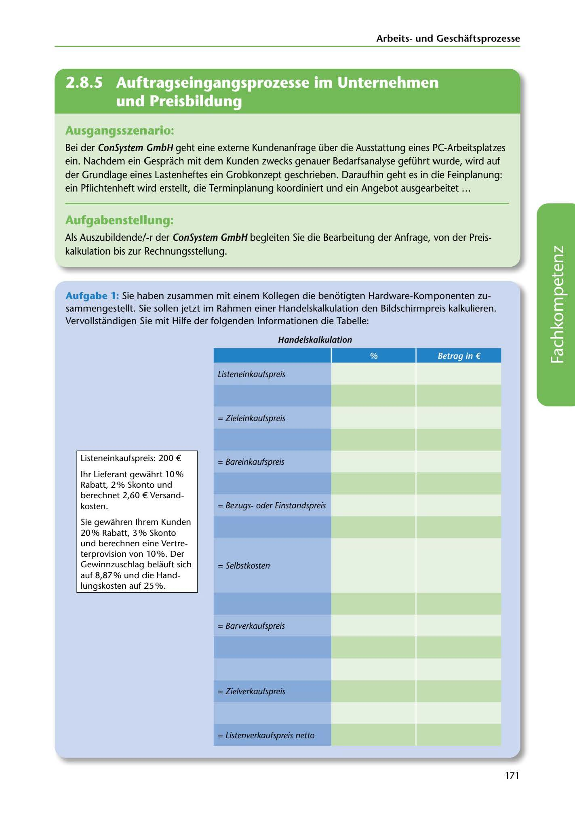

---
## Page 173
---

Arbeitsund Geschaftsprozesse

<!-- IMAGE: page-173-img-1.jpeg - TODO: Add description -->

**[VISUAL: CONSYSTEM GMBH SCENARIO HEADER]**
Header image for the ConSystem GmbH customer inquiry and price calculation scenario.

## Ausgangsszenario:

Bei der ConSystem GmbH geht eine externe Kundenanfrage über die Ausstattung eines PC-Arbeitsplatzes ein. Nachdem ein Gesprach mit dem Kunden zwecks genauer Bedarfsanalyse geführt w urde, wird auf der Grundlage eines Lastenheftes ein Grobkonzept geschrieben. Daraufhin geht es in die Feinplanung: ein Pflichtenheft w ird erstellt, die Terminplanung koordiniert und ein Angebot ausgearbeitet ...

## Aufgabenstellung·

Als Auszubildende/-r der ConSystem GmbH begleiten Sie die Bearbeitung der Anfrage, von der Preis- kalkulation bis zur Rechnungsstellung.

Aufgabe 1: Sie haben zusammen mit einem Kollegen die benotigten Hardware-Kom ponenten zu- sammengestellt. Sie sollen jetzt im Rahmen einer Handelskalkulation den Bildschirmpreis kalkulieren. Vervollstandigen Sie mit Hilfe der folgenden lnformationen die Tabelle:

### Handelskalkulation

Betrag in€

**[VISUAL: TRADE CALCULATION TABLE (HANDELSKALKULATION)]**
A blank calculation table template for students to perform a complete trade calculation from list purchase price to net list sales price, including spaces for: discount, cash discount, shipping costs, handling costs, profit margin, sales discount, and commissions.

Listeneinkaufspreis

**[VISUAL: TRADE CALCULATION TABLE (HANDELSKALKULATION)]**
A blank calculation table template for students to perform a complete trade calculation from list purchase price to net list sales price, including spaces for: discount, cash discount, shipping costs, handling costs, profit margin, sales discount, and commissions.

= Zieleinkaufspreis

Listeneinkaufspreis: 200 €

= Bareinkaufspreis

= Bezugsoder Einstandspreis

1hr Lieferant gewahrt 10% Rabatt, 2 o/o Skonto und berechnet 2,60 € Versand- kosten.

= Se/bstkosten

Sie gewahren lhrem Kunden 20 o/o Rabatt, 3 % Skonto und berechnen eine Vertre- terprovision von 10%. Der Gewinnzuschlag belauft sich auf 8,87% und die Hand- lungskosten auf 25 o/o.

## = Barverkaufspreis

= Zielverkaufspreis

= Listenverkaufspreis netto

171
