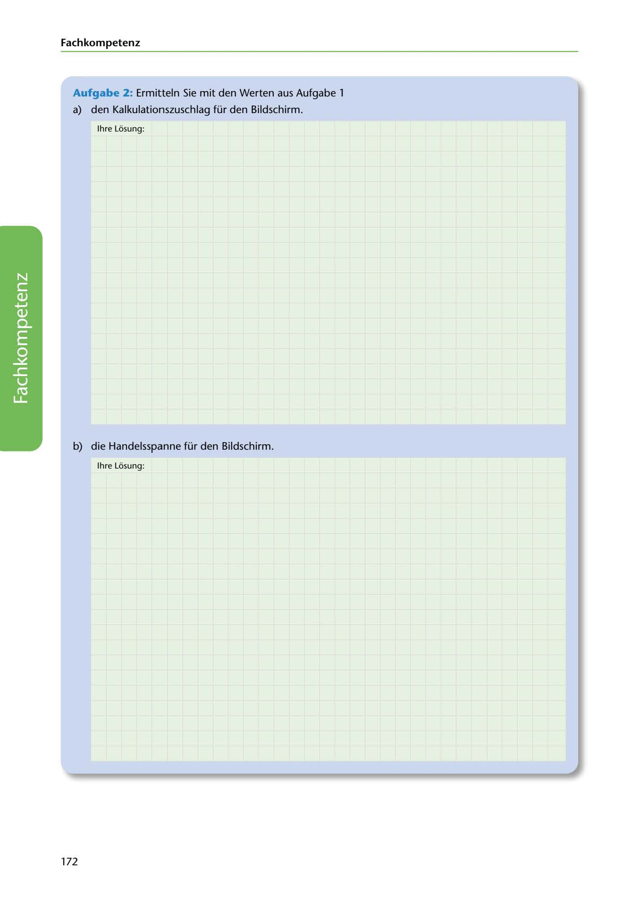

---
## Page 174
---

### Fach kom petenz

### Aufgabe 2: Ermitteln Sie mit den Werten aus Aufgabe 1

a) den Kalkulationszuschlag für den Bildschirm.

lhre Losung:

<!-- IMAGE: page-174-img-1.jpeg - TODO: Add description -->

b) die Handelsspanne für den Bildschirm.

lhre Losung:

172
