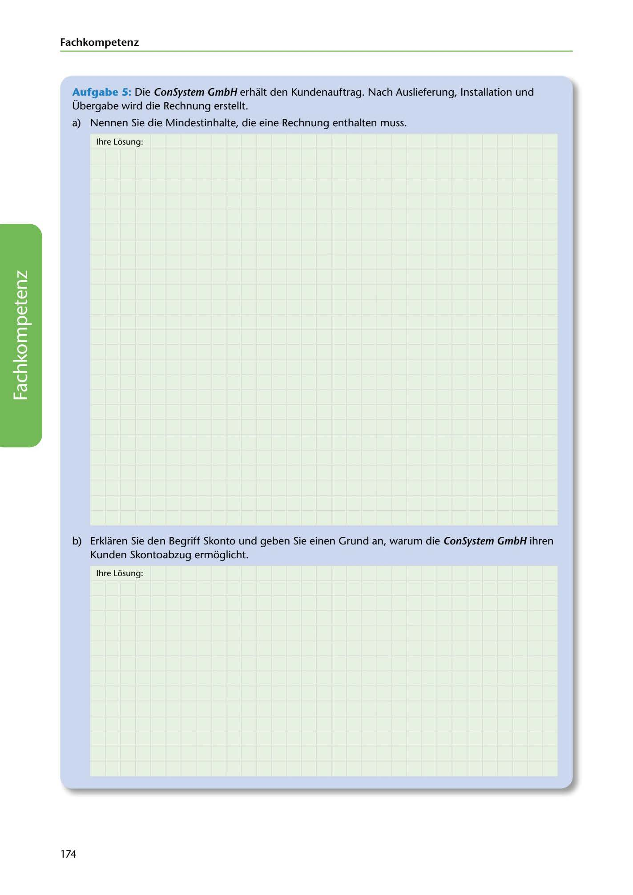

---
## Page 176
---

Fach kom petenz

Aufgabe 5: Die ConSystem GmbH erhalt den Kundenauftrag. Nach Auslieferung, lnstallation und Übergabe wird die Rechnung erstellt.

a) Nennen Sie die Mindestinhalte, die eine Rechnung enthalten muss.

lhre Losung:

<!-- IMAGE: page-176-img-1.jpeg - TODO: Add description -->

b) Erklaren Sie den Begriff Skonto und geben Sie einen Grund an, warum die ConSystem GmbH ihren Kunden Skontoabzug ermoglicht.

lhre Losung:

174
