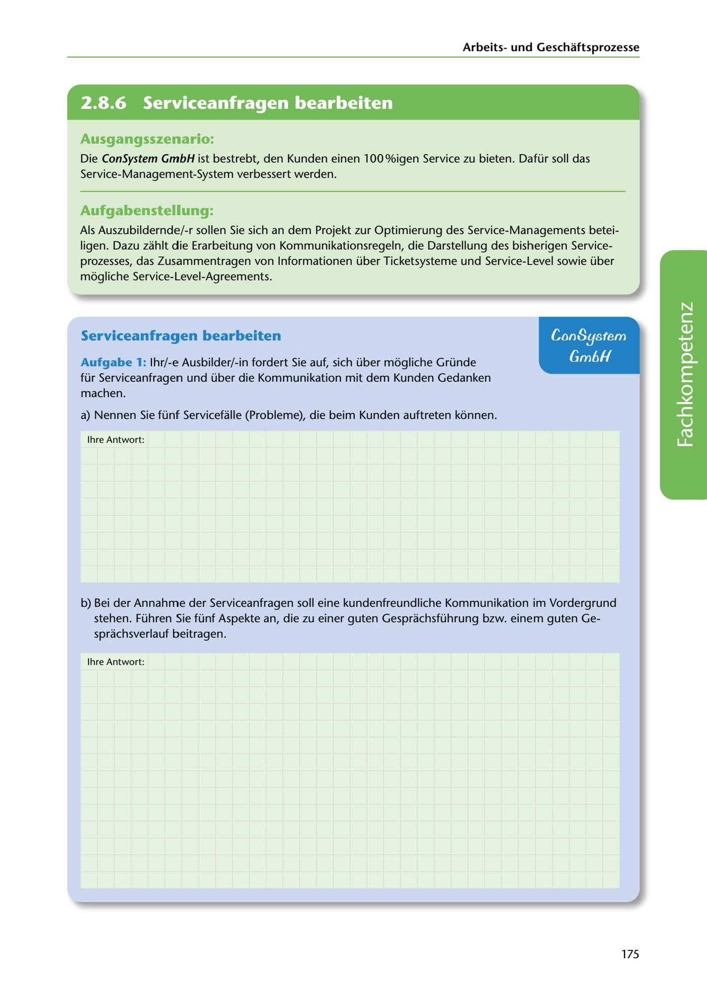

---
## Page 177
---

Arbeitsund Geschaftsprozesse

<!-- IMAGE: page-177-img-1.jpeg - TODO: Add description -->

**[VISUAL: CONSYSTEM GMBH SCENARIO HEADER]**
Header image for the ConSystem GmbH service management optimization scenario.

## Ausgangsszenario:

Die ConSystem GmbH ist bestrebt, den Kunden einen 100%igen Service zu bieten. Dafür soll das Service-Management-System verbessert werden.

## Aufgabenstellung:

Als Auszubildernde/-r sollen Sie sich an dem Projekt zur Optimierung des Service-Managements betei-

ligen. Dazu zahlt die Erarbeitung von Kommunikationsregeln, die Darstellung des bisherigen Service- prozesses, das Zusammentragen von lnformationen über Ticketsysteme und Service-Level sowie über mogliche Service-Level-Agreements.

## Con8ystem

## Serviceanfragen bearbeiten

## Gm6H

Aufgabe 1: lhr/-e Ausbilder/-in fordert Sie auf, sich über mogliche Gründe für Serviceanfragen und über die Kommunikation mit dem Kunden Gedanken machen.

a) Nennen Sie fünf Servicefalle (Probleme), die beim Kunden auftreten konnen.

lhre Antwort:

**[VISUAL: ANSWER SPACE]**
Blank lined area for students to list five service cases (problems) that can occur at the customer site.

b) Bei der Annahme der Serviceanfragen soll eine kundenfreundliche Kommunikation im Vordergrund

stehen. Führen Sie fünf Aspekte an, die zu einer guten Gesprachsführung bzw. einem guten Ge- sprachsverlauf beitragen.

lhre Antwort:

175
