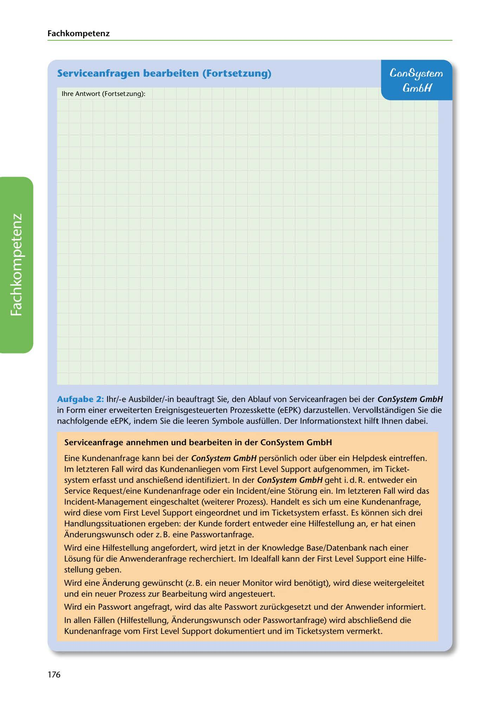

---
## Page 178
---

Fach kom petenz

### Serviceanfragen bearbeiten (Fortsetzung)

## ConSystem

## Gm6H

lhre Antwort (Fortsetzung):

<!-- IMAGE: page-178-img-1.jpeg - TODO: Add description -->

Aufgabe 2: lhr/-e Ausbilder/-in beauftragt Sie, den Ablauf von Serviceanfragen bei der ConSystem GmbH in Form einer erweiterten Ereignisgesteuerten Prozesskette (eEPK) darzustellen. Vervollstandigen Sie die nachfolgende eEPK, indem Sie die leeren Symbole ausfüllen. Der lnformationstext hilft lhnen dabei.

Serviceanfrage annehmen und bearbeiten in der ConSystem GmbH

Eine Kundenanfrage kann bei der ConSystem GmbH personlich oder über ein Helpdesk eintreffen. lm letzteren Fall wird das Kundenanliegen vom First Level Support aufgenommen, im Ticket- system erfasst und anschiel!.end identifiziert. In der ConSystem GmbH geht i. d. R. entweder ein Service Request/eine Kundenanfrage oder ein lncident/eine Storung ein. lm letzteren Fall w ird das lncident-Management eingeschaltet (weiterer Prozess). Handelt es sich um eine Kundenanfrage, wird diese vom First Level Support eingeordnet und im Ticketsystem erfasst. Es konnen sich drei

Handlungssituationen ergeben: der Kunde fordert entweder eine Hilfestellung an, er hat einen Anderungswunsch oder z. B. eine Passwortanfrage.

Wird eine Hilfestellung angefordert, wird jetzt in der Knowledge Base/Datenbank nach einer

Losung für die Anwenderanfrage recherchiert. lm ldealfall kann der First Level Support eine Hilfe- stellung geben.

Wird eine Anderung gewünscht (z. B. ein neuer Monitor wird benotigt), wird diese weitergeleitet und ein neuer Prozess zur Bearbeitung wird angesteuert.

Wird ein Passwort angefragt, wird das alte Passwort zurückgesetzt und der Anwender informiert.

In allen Fallen (Hilfestellung, Anderungswunsch oder Passwortanfrage) wird abschliel!.end die Kundenanfrage vom First Level Support dokumentiert und im Ticketsystem vermerkt.

176
