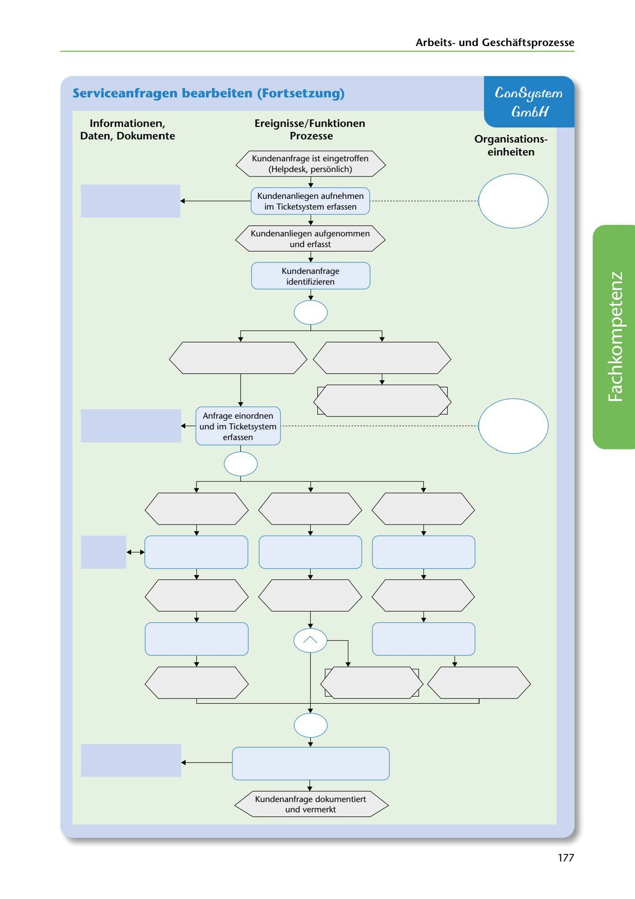

---
## Page 179
---

Arbeitsund Geschaftsprozesse

## Serviceanfragen bearbeiten (Fortsetzung)

## ConSystem

## Gm6H

### 1 nformationen,

### Daten, Dokumente

### Ereignisse/ Funktionen

### Prozesse

### Organ isations-

### einheiten

Kundenanfrage ist eingetroffen (Helpdesk, persiinlich)

Kundenanliegen aufnehmen ···································O

im Ticketsystem erfassen

Kundenanliegen aufgenommen und erfasst

Kundenanfrage identifizieren

<!-- IMAGE: page-179-img-1.jpeg - TODO: Add description -->

**[VISUAL: SERVICE REQUEST PROCESSING eEPK DIAGRAM]**
An extended Event-driven Process Chain (eEPK) diagram showing the service request handling workflow with four columns: Informationen/Daten/Dokumente (left), Ereignisse/Funktionen (center-left), Prozesse (center-right), and Organisationseinheiten (right). The process flow shows: customer inquiry arrival → capture customer concern → register in ticket system → identify customer request → document and note request. Decision points and organizational responsibilities are shown throughout.

**[VISUAL: SERVICE REQUEST PROCESSING eEPK DIAGRAM]**
An extended Event-driven Process Chain (eEPK) diagram showing the service request handling workflow with four columns: Informationen/Daten/Dokumente (left), Ereignisse/Funktionen (center-left), Prozesse (center-right), and Organisationseinheiten (right). The process flow shows: customer inquiry arrival → capture customer concern → register in ticket system → identify customer request → document and note request. Decision points and organizational responsibilities are shown throughout.

**[VISUAL: SERVICE REQUEST PROCESSING eEPK DIAGRAM]**
An extended Event-driven Process Chain (eEPK) diagram showing the service request handling workflow with four columns: Informationen/Daten/Dokumente (left), Ereignisse/Funktionen (center-left), Prozesse (center-right), and Organisationseinheiten (right). The process flow shows: customer inquiry arrival → capture customer concern → register in ticket system → identify customer request → document and note request. Decision points and organizational responsibilities are shown throughout.

**[VISUAL: SERVICE REQUEST PROCESSING eEPK DIAGRAM]**
An extended Event-driven Process Chain (eEPK) diagram showing the service request handling workflow with four columns: Informationen/Daten/Dokumente (left), Ereignisse/Funktionen (center-left), Prozesse (center-right), and Organisationseinheiten (right). The process flow shows: customer inquiry arrival → capture customer concern → register in ticket system → identify customer request → document and note request. Decision points and organizational responsibilities are shown throughout.

Kundenanfrage dokumentiert und vermerkt

177
