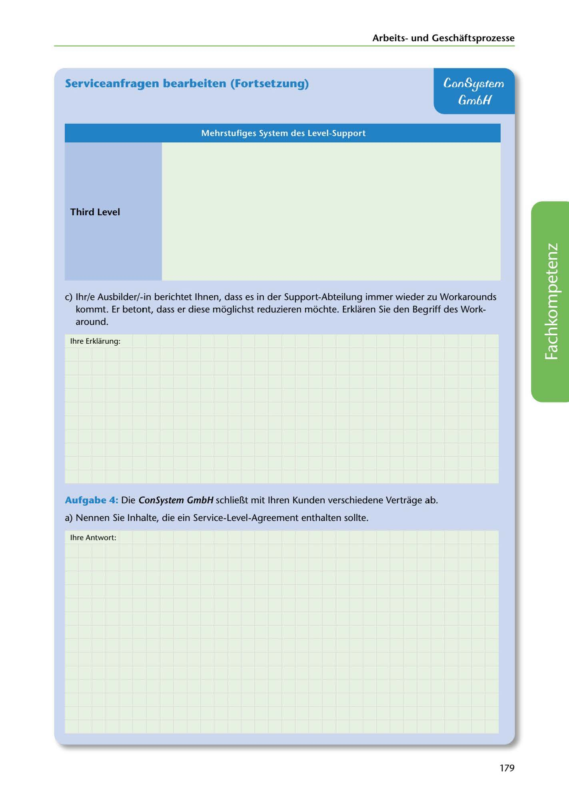

---
## Page 181
---

Arbeitsund Geschaftsprozesse

## Serviceanfragen bearbeiten (Fortsetzung)

## ConSystem

## Gm6H

### Mehrstufiges System des Level-Support

### Third Level

e) lhr/e Ausbilder/-in berichtet lhnen, dass es in der Support-Abteilung immer wieder zu Workarounds

kommt. Er betont, dass er diese moglichst reduzieren mochte. Erklaren Sie den Begriff des Work- around.

lhre Erklarung:

<!-- IMAGE: page-181-img-1.jpeg - TODO: Add description -->

Aufgabe 4 : Die ConSystem GmbH schlier..t mit lhren Kunden verschiedene Vertrage ab.

a) Nennen Sie lnhalte, die ein Service-Level-Agreement enthalten sollte.

lhre Antwort:

179
