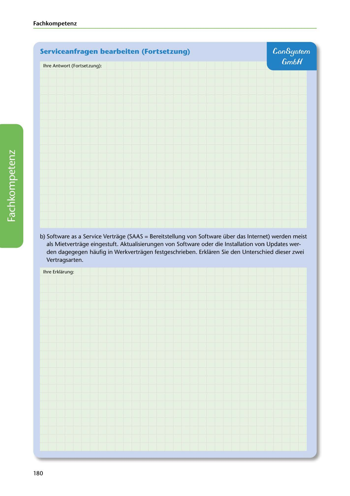

---
## Page 182
---

Fach kom petenz

## ConSystem

## Serviceanfragen bearbeiten (Fortsetzung)

## Gm6H

lhre Antwort (Fortsetzung):

b) Software as a Service Vertrage (SAAS = Bereitstellung van Software über das Internet) werden meist

<!-- IMAGE: page-182-img-1.jpeg - TODO: Add description -->

als Mietvertrage eingestuft. Aktualisierungen van Software oder die lnstallation van Updates wer- den dagegegen haufig in Werkvertragen festgeschrieben. Erklaren Sie den Unterschied dieser zwei Vertragsarten.

lhre Erklarung:

180
