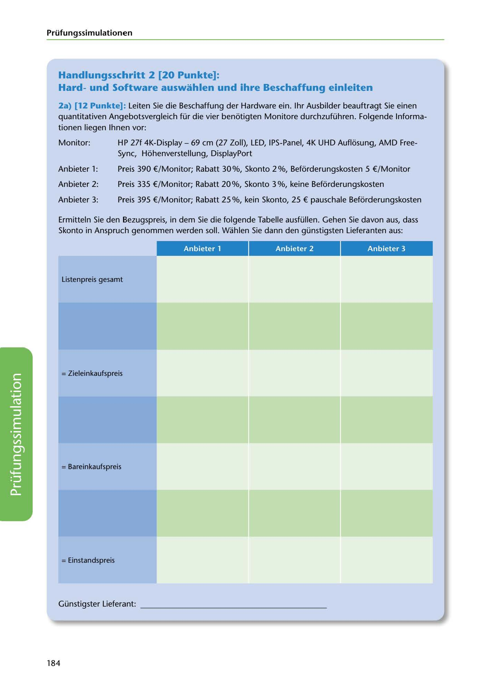

---
## Page 186
---

### Prüfungssimulationen

## Handlungsschritt 2 [20 Punkte]:

### Hardund Software auswahlen und ihre Beschaffung einleiten

2a) [12 Punkte]: Leiten Sie die Beschaffung der Hardware ein. 1hr Ausbilder beauftragt Sie einen quantitativen Angebotsvergleich für die vier benotigten Monitore durchzuführen. Folgende lnforma- tionen liegen lhnen vor:

Monitor:

HP 27f 4K-Display - 69 cm (27 Zoll), LED, IPS-Panel, 4K UHD Auflosung, AMD Free- Sync, Hohenverstellung, DisplayPort

Preis 390 €/ Monitor; Rabatt 30 %, Skonto 2 %, Beforderungskosten 5 €/Monitor

### Anbieter 1:

Anbieter 2:

Preis 335 €/Monitor; Rabatt 20 %, Skonto 3 %, keine Befürderungskosten

Anbieter 3:

Preis 395 €/Monitor; Rabatt 25 %, kein Skonto, 25 € pauschale Beforderungskosten

Ermitteln Sie den Bezugspreis, in dem Sie die folgende Tabelle ausfüllen. Gehen Sie davon aus, dass Skonto in Anspruch genommen werden soll. Wahlen Sie dann den günstigsten Lieferanten aus:

### Anbieter 1

### Anbieter 2

### Anbieter 3

Listenpreis gesamt

= Zieleinkaufspreis

= Bareinkaufspreis

<!-- IMAGE: page-186-img-1.jpeg - TODO: Add description -->

= Einstandspreis

## Günstigster Lieferant: __________________ _

184
