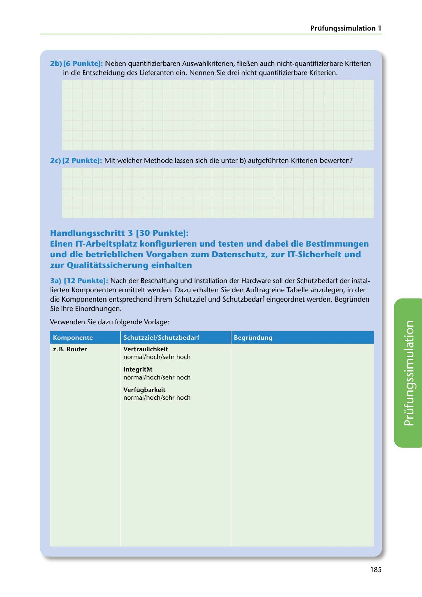

---
## Page 187
---

Prüfungssimulation 1

2b) [6 Punkte]: Neben quantifizierbaren Auswahlkriterien, flieí!,en auch nicht-quantifizierbare Kriterien in die Entscheidung des Lieferanten ein. Nennen Sie drei nicht quantifizierbare Kriterien.

2c) [2 Punkte]: Mit welcher Methode lassen sich die unter b) aufgeführten Kriterien bewerten?

## Handlungsschritt 3 [30 Punkte]:

## und die betrieblichen Vorgaben zum Datenschutz, zur IT-Sicherheit und

## zur Qualitatssicherung einhalten

Einen IT-Arbeitsplatz konfigurieren und testen und dabei die Bestimmungen

3a) [12 Punkte]: Nach der Beschaffung und lnstallation der Hardware soll der Schutzbedarf der instal- lierten Komponenten ermittelt werden. Dazu erhalten Sie den Auftrag eine Tabelle anzulegen, in der die Komponenten entsprechend ihrem Schutzziel und Schutzbedarf eingeordnet werden. Begründen Sie ihre Einordnungen.

Verwenden Sie dazu folgende Vorlage:

### Komponente

### Schutzziel/Schutzbedarf

### Begründung

### z. B. Router

### Vertraulichkeit

normal/hochhehrhoch

### lntegritat

normal/hochhehrhoch

### Verfügbarkeit

normal/hochhehrhoch

<!-- IMAGE: page-187-img-1.jpeg - TODO: Add description -->

185
