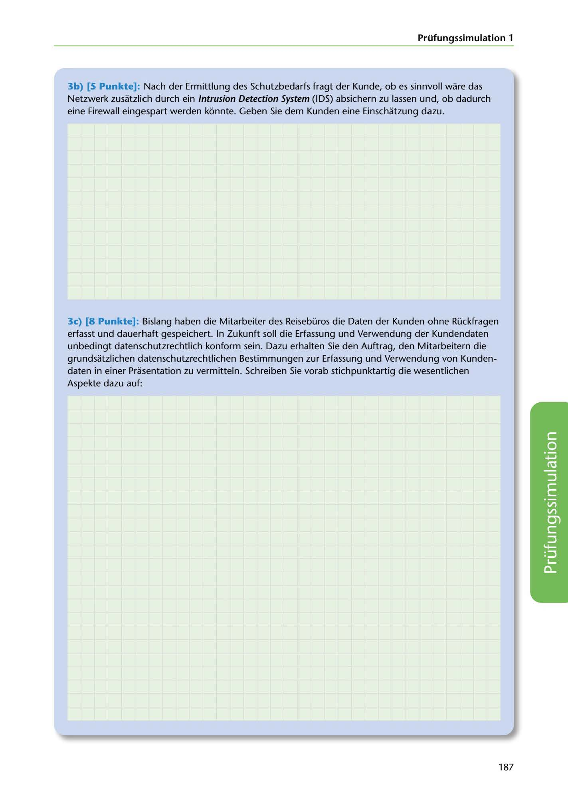

---
## Page 189
---

Prüfungssimulation 1

3b) (5 Punkte]: Nach der Ermittlung des Schutzbedarfs fragt der Kunde, ob es sinnvoll ware das Netzwerk zusatzlich durch ein lntrusion Detection System (IDS) absichern zu lassen und, ob dadurch eine Firewall eingespart werden konnte. Geben Sie dem Kunden eine Einschatzung dazu.

3c) (8 Punkte]: Bislang haben die Mitarbeiter des Reisebüros die Daten der Kunden ohne Rückfragen erfasst und dauerhaft gespeichert. In Zukunft soll die Erfassung und Verwendung der Kundendaten unbedingt datenschutzrechtlich konform sein. Dazu erhalten Sie den Auftrag, den Mitarbeitern die grundsatzlichen datenschutzrechtlichen Bestimmungen zur Erfassung und Verwendung van Kunden- daten in einer Prasentation zu vermitteln. Schreiben Sie vorab stichpunktartig die wesentlichen Aspekte dazu auf:

<!-- IMAGE: page-189-img-1.jpeg - TODO: Add description -->

187
