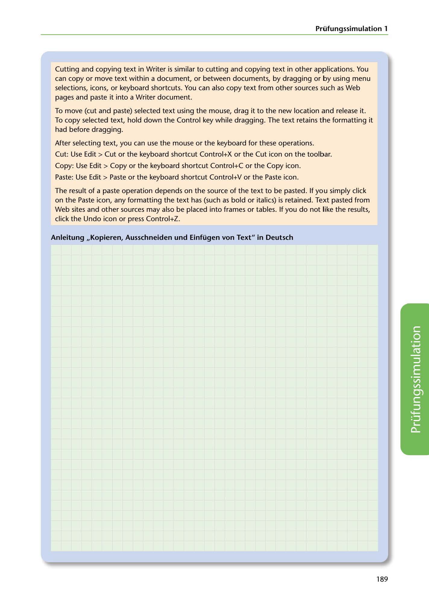

---
## Page 191
---

### Prüfungssimulation 1

Cutting and copying text in Writer is similar to cutting and copying text in other applications. You can copy or move text within a document, or between documents, by dragging or by using menu selections, icons, or keyboard shortcuts. You can also copy text from other sources such as Web pages and paste it into a Writer document.

To move (cut and paste) selected text using the mouse, drag it to the new location and release it. To copy selectedl text, hold down the Control key while dragging. The text retains the formatting it had before dragging.

After selecting text, you can use the mouse or the keyboard for these operations.

Cut: Use Edit > Cut or the keyboard shortcut Control+X or the Cut icon on the toolbar.

Copy: Use Edit > Copy or the keyboard shortcut Control+C or the Copy icon.

Paste: Use Edit > Paste or the keyboard shortcut Control+V or the Paste icon.

The result of a paste operation depends on the source of the text to be pasted. lf you simply click on the Paste icon, any formatting the text has (such as bold or italics) is retained. Text pasted from Web sites and other sources may also be placed into trames or tables. lf you do not like the results, click the Undo icon or press Control+Z.

Anleitung ,,Kopieren, Ausschneiden und Einfügen von Text" in Deutsch

<!-- IMAGE: page-191-img-1.jpeg - TODO: Add description -->

189
