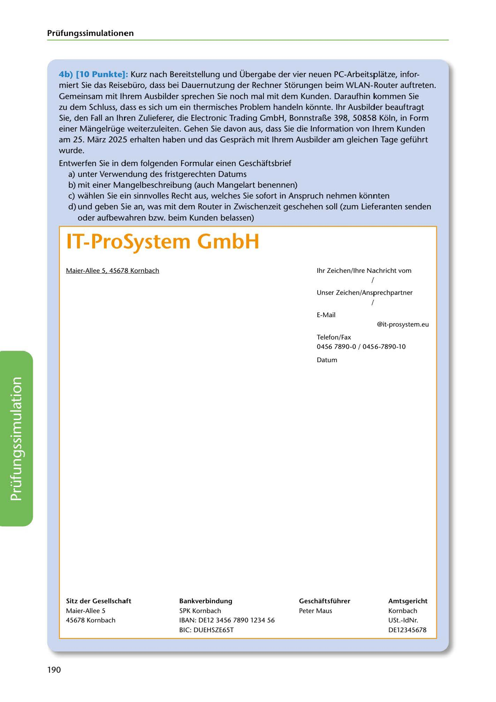

---
## Page 192
---

Prüfungssimulationen

4b) [10 Punkte]: Kurz nach Bereitstellung und Übergabe der vier neuen PC-Arbeitsplatze, infor- miert Sie das Reisebüro, dass bei Dauernutzung der Rechner Storungen beim WLAN-Router auftreten. Gemeinsam mit lhrem Ausbilder sprechen Sie noch mal mit dem Kunden. Daraufhin kommen Sie zu dem Schluss, dlass es sich um ein thermisches Problem handeln konnte. 1hr Ausbilder beauftragt Sie, den Fall an lhren Zulieferer, die Electronic Trading GmbH, Bonnstra~e 398, 50858 Koln, in Form einer Mangelrüge weiterzuleiten. Gehen Sie davon aus, dass Sie die lnformation von lhrem Kunden am 25. Marz 2025 erhalten haben und das Gesprach mit lhrem Ausbilder am gleichen Tage geführt wurde.

Entwerfen Sie in dem folgenden Formular einen Geschaftsbrief

# IT-ProSystem GmbH

a) unter Verwendung des fristgerechten Datums b) mit einer Mangelbeschreibung (auch Mangelart benennen) e) wahlen Sie e1in sinnvolles Recht aus, welches Sie sofort in Anspruch nehmen konnten d) und geben Sie an, was mit dem Router in Zwischenzeit geschehen soll (zum Lieferanten senden oder aufbewahren bzw. beim Kunden belassen)

1hr Zeichen/ lhre Nachricht vom

Maier-Allee 5 45678 Kornbach

f

Unser Zeichen/Ansprechpartner

f

E-Mail

@it-prosystem.eu

Telefon/Fax 0456 7890-0 / 0456-7890-1 O

Datum

<!-- IMAGE: page-192-img-1.jpeg - TODO: Add description -->

### Sitz der Gesellschaft

### Bankverbindung

### Geschaftsführer

### Amtsgericht

Peter Maus

Maier-Allee 5 45678 Kornbach

SPK Kornbach IBAN: DE12 3456 7890 1234 56

Kornbach USt.-ldNr.

BIC: DUEHSZE65T

DE12345678

190
