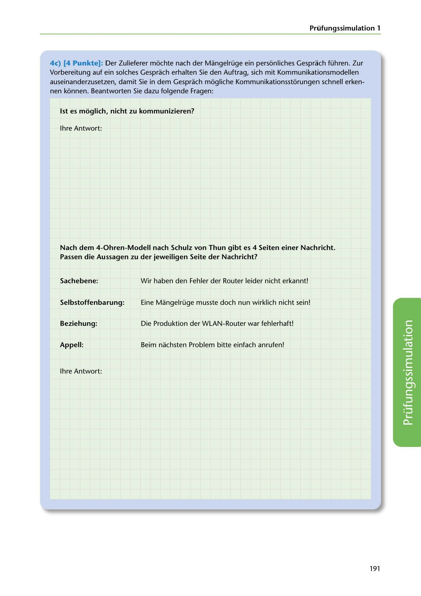

---
## Page 193
---

Prüfungssimulation 1

4c) (4 Punkte): Der Zulieferer mochte nach der Mangelrüge ein personliches Gesprach führen. Zur Vorbereitung auf ein solches Gesprach erhalten Sie den Auftrag, sich mit Kommunikationsmodellen auseinanderzusetzen, damit Sie in dem Gesprach mogliche Kommunikationsstorungen schnell erken- nen konnen. Beantworten Sie dazu folgende Fragen:

### 1st es moglich, nicht zu kommunizieren?

lhre Antwort:

### Passen die Aussagen zu der jeweiligen Seite der Nachricht?

Nach dem 4-0hren-Modell nach Schulz von Thun gibt es 4 Seiten einer Nachricht.

### Sachebene:

Wir haben den Fehler der Router leider nicht erkannt!

### Selbstoffenbarung:

Eine Mangelrüge musste doch nun wirklich nicht sein!

### Beziehung:

Die Produktion der WLAN-Router war fehlerhaf t!

### Appell:

Beim nachsten Problem bitte einfach anrufen!

lhre Antwort:

<!-- IMAGE: page-193-img-1.jpeg - TODO: Add description -->

191
