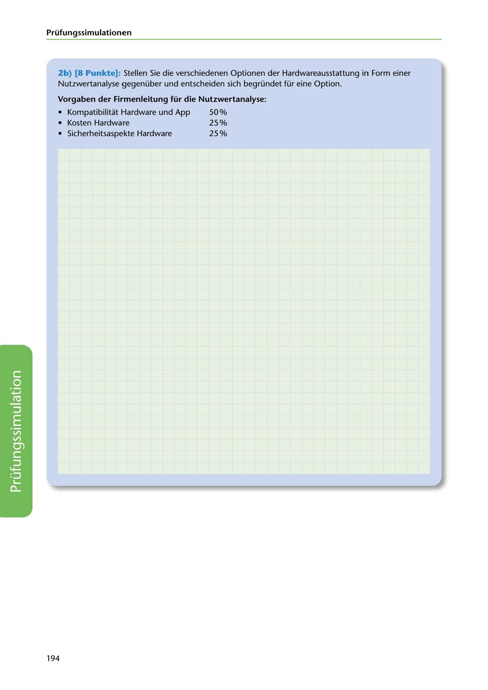

---
## Page 196
---

Prüfungssimulationen

2b) [8 Punkte): Stellen Sie die verschiedenen Optionen der Hardwareausstattung in Form einer Nutzwertanalyse gegenüber und entscheiden sich begründet für eine Option.

### Vorgaben der Firmenleitung für die Nutzwertanalyse:

• Kompatibilitat Hardware und App 50 o/o • Kosten Hardware 25% • Sicherheitsaspekte Hardware 25 o/o

<!-- IMAGE: page-196-img-1.jpeg - TODO: Add description -->

194
