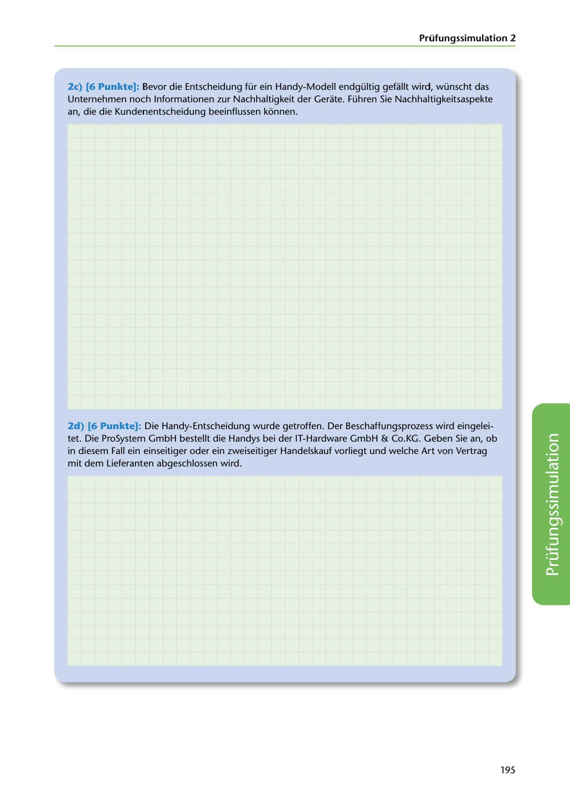

---
## Page 197
---

### Prüfungssimulation 2

2c) [6 Punkte]: Bevor die Entscheidung für ein Handy-Modell endgültig gefüllt wird, wünscht das Unternehmen noch lnformationen zur Nachhaltigkeit der Gerate. Führen Sie Nachhaltigkeitsaspekte an, die die Kundenentscheidung beeinflussen konnen.

2d) [6 Punkte]: Die Handy-Entscheidung wurde getroffen. Der Beschaffungsprozess wird eingelei- tet. Die ProSystem GmbH bestellt die Handys bei der IT-Hardware GmbH & Co.KG. Geben Sie an, ob in diesem Fall ein einseitiger oder ein zweiseitiger Handelskauf vorliegt und welche Art von Vertrag mit dem Lieferanten abgeschlossen wird.

<!-- IMAGE: page-197-img-1.jpeg - TODO: Add description -->

195
