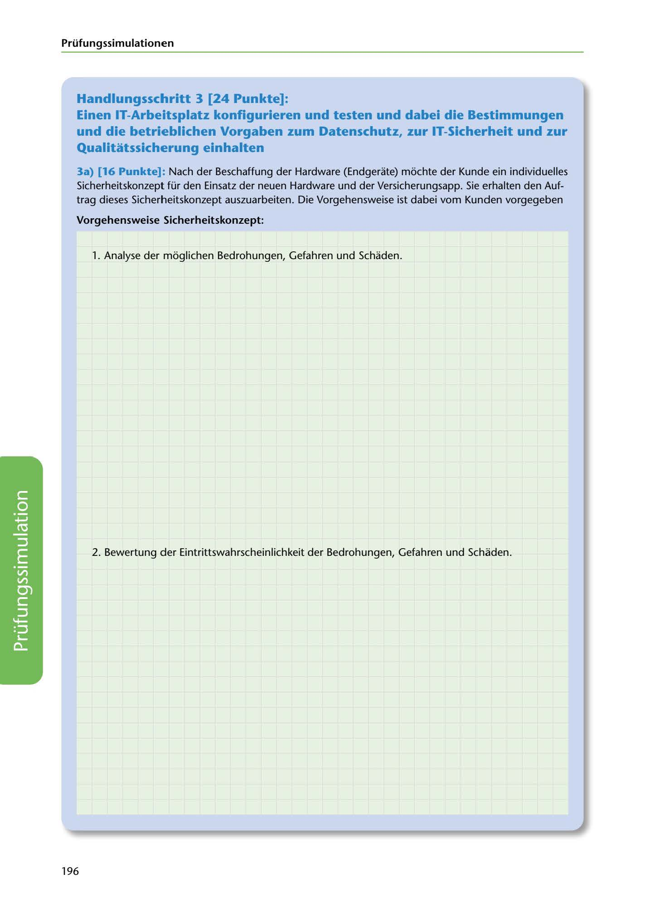

---
## Page 198
---

Prüfungssimulationen

## Handlungsschritt 3 [24 Punkte]:

### Qualitatssicherung einhalten

Einen IT-Arbeitsplatz konflgurieren und testen und dabei die Bestimmungen und die betrieblichen Vorgaben zum Datenschutz, zur IT-Sicherheit und zur

3a) (16 Punkte]: Nach der Beschaffung der Hardware (Endgerate) mochte der Kunde ein individuelles Sicherheitskonzept für den Einsatz der neuen Hardware und der Versicherungsapp. Sie erhalten den Auf- trag dieses Sicherheitskonzept auszuarbeiten. Die Vorgehensweise ist dabei vom Kunden vorgegeben

### Vorgehensweise Sicherheitskonzept:

1. Analyse der moglichen Bedrohungen, Gefahren und Schaden.

2. Bewertung der Eintrittswahrscheinlichkeit der Bedrohungen, Gefahren und Schaden.

<!-- IMAGE: page-198-img-1.jpeg - TODO: Add description -->

196
