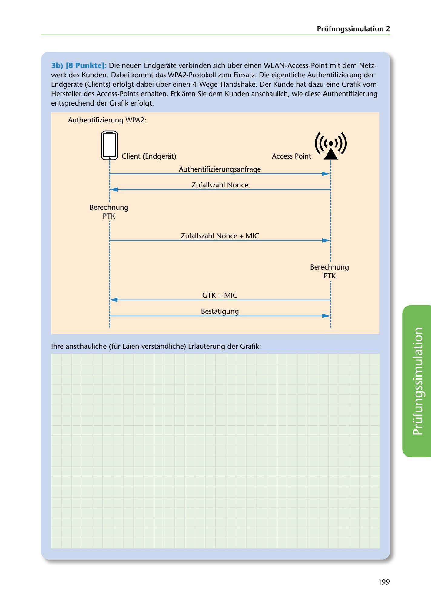

---
## Page 201
---

### Prüfungssimulation 2

3b) (8 Punkte]: Die neuen Endgerate verbinden sich über einen WLAN-Access-Point mit dem Netz- werk des Kunden. Dabei kommt das WPA2-Protokoll zum Einsatz. Die eigentliche Authentifizierung der Endgerate (Clients) erfolgt dabei über einen 4-Wege-Handshake. Der Kunde hat dazu eine Grafik vom Hersteller des Access-Points erhalten. Erklaren Sie dem Kunden anschaulich, wie diese Authentifizierung entsprechend der Grafik erfolgt.

Authentifizierung WPA2:

# ((<•>))

# Access Point ~

## ~ ¡ ~ Cl;ent(Endgecat)

### Authentifizierungsanfrage

## :

# 1 !

### Zufallszahl Nance

1 :

Beredmung

PTK

Zufallszahl Nance+ MIC

Berechnung PTK

GTK + MIC

Bestatigung

lhre anschauliche (für Laien verstandliche) Erlauterung der Grafik:

<!-- IMAGE: page-201-img-1.jpeg - TODO: Add description -->

199
