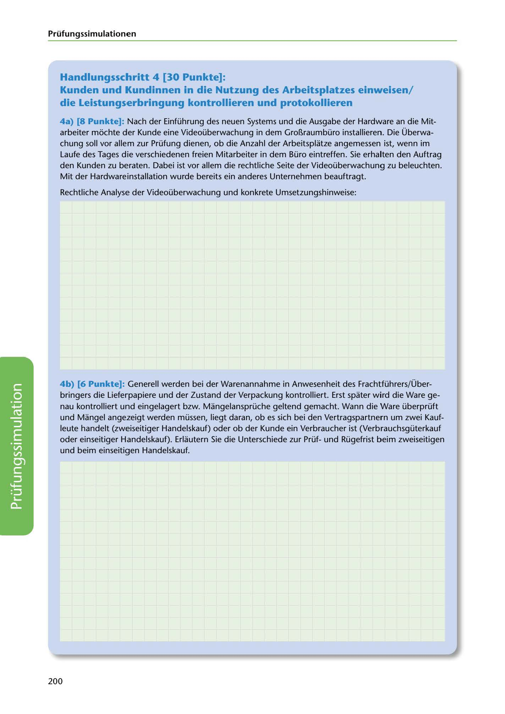

---
## Page 202
---

### Prüfungssimulationen

## Handlungsschritt 4 [30 Punkte]:

### die Leistungserbringung kontrollieren und protokollieren

Kunden und Kundinnen in die Nutzung des Arbeitsplatzes einweisen/

4a) [8 Punkte]: Nach der Einführung des neuen Systems und die Ausgabe der Hardware an die Mit- arbeiter mochte dler Kunde eine Videoüberwachung in dem Grol1raumbüro installieren. Die Überwa- chung soll vor allem zur Prüfung dienen, ob die Anzahl der Arbeitsplatze angemessen ist, wenn im Laufe des Tages die verschiedenen freien Mitarbeiter in dem Büro eintreffen. Sie erhalten den Auftrag den Kunden zu beraten. Dabei ist vor allem die rechtliche Seite der Videoüberwachung zu beleuchten. Mit der Hardwareinstallation wurde bereits ein anderes Unternehmen beauftragt.

Rechtliche Analyse der Videoüberwachung und konkrete Umsetzungshinweise:

4b) [6 Punkte]: Generell werden bei der Warenannahme in Anwesenheit des Frachtführers/ Über-

bringers die Lieferpapiere und der Zustand der Verpackung kontrolliert. Erst spater wird die Ware ge- nau kontrolliert und eingelagert bzw. Mangelansprüche geltend gemacht. Wann die Ware überprüft und Mangel angezeigt werden müssen, liegt daran, ob es sich bei den Vertragspartnern um zwei Kauf- leute handelt (zweiseitiger Handelskauf) oder ob der Kunde ein Verbraucher ist (Verbrauchsgüterkauf oder einseitiger Handelskauf). Erlautern Sie die Unterschiede zur Prüfund Rügefrist beim zweiseitigen und beim einseitigen Handelskauf.

<!-- IMAGE: page-202-img-1.jpeg - TODO: Add description -->

200
