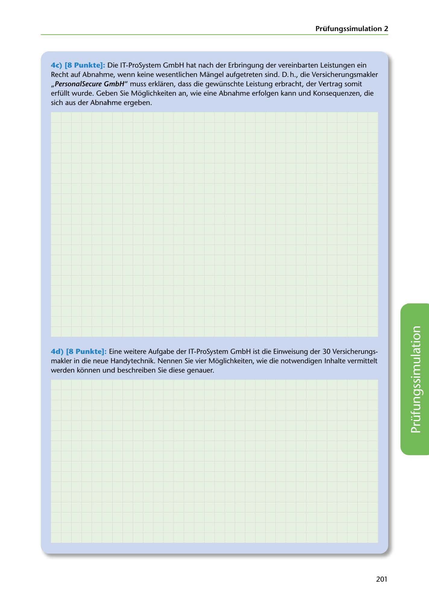

---
## Page 203
---

### Prüfungssimulation 2

4c) [8 Punkte]: Die IT-ProSystem GmbH hat nach der Erbringung der vereinbarten Leistungen ein

Recht auf Abnahme, wenn keine wesentlichen Mangel aufgetreten sind. D. h., die Versicherungsmakler ,,Persona/Secure GmbH" muss erklaren, dass die gewünschte Leistung erbracht, der Vertrag somit erfüllt wurde. Geben Sie Moglichkeiten an, wie eine Abnahme erfolgen kann und Konsequenzen, die sich aus der Abnahme ergeben.

4d) [8 Punkte]: Eine weitere Aufgabe der IT-ProSystem GmbH ist die Einweisung der 30 Versicherungs-

makler in die neue Handytechnik. Nennen Sie vier Moglichkeiten, wie die notwendigen lnhalte vermittelt werden konnen u111d beschreiben Sie diese genauer.

<!-- IMAGE: page-203-img-1.jpeg - TODO: Add description -->

201
