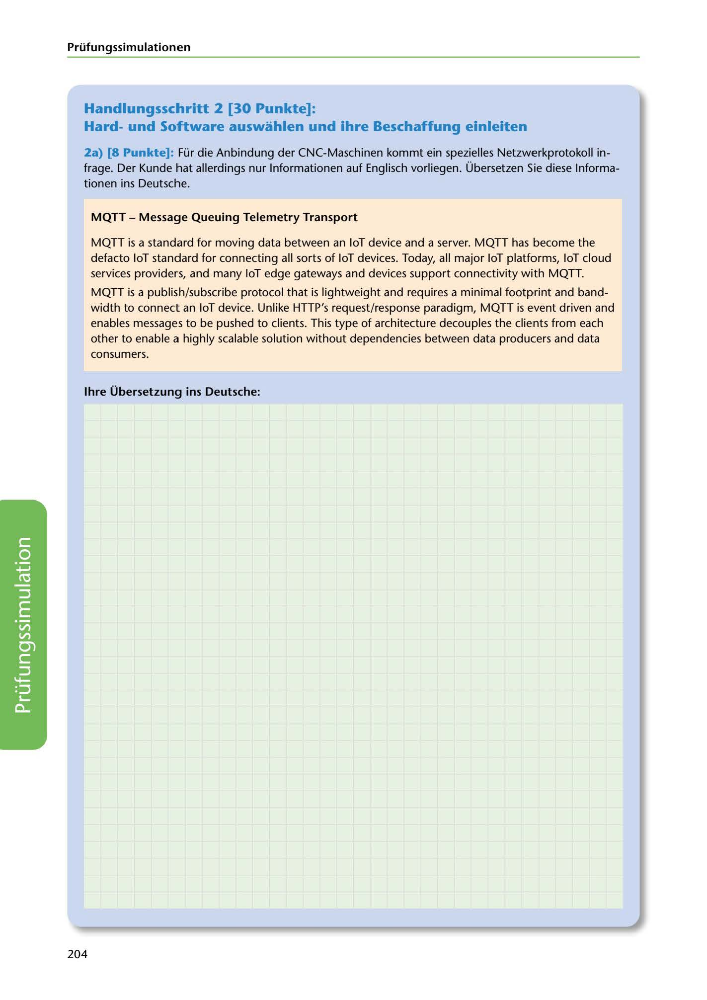

---
## Page 206
---

### Prüfungssimulationen

## Handlungsschritt 2 [30 Punkte]:

### Hardund Software auswahlen und ihre Beschaffung einleiten

2a) (8 Punkte]: Für die Anbindung der CNC-Maschinen kommt ein spezielles Netzwerkprotokoll in- frage. Der Kunde 1,at allerdings nur lnfarmationen auf Englisch vorliegen. Übersetzen Sie diese lnfarma- tionen ins Deutsche.

### MQTT - Message Queuing Telemetry Transport

MQTT is a standard far moving data between an loT device and a server. MQTT has become the defacto loT standard far connecting all sorts of loT devices. Today, all majar loT platforms, loT cloud services providers, and many loT edge gateways and devices support connectivity with MQTT.

MQTT is a publish/subscribe protocol that is lightweight and requires a minimal faotprint and band- width to connect an loT device. Unlike HTTP's request/response paradigm, MQTT is event driven and enables messages to be pushed to clients. This type of architecture decouples the clie11ts from each other to enable a highly scalable solution without dependencies between data producers and data consumers.

### lhre Übersetzung ins Deutsche:

<!-- IMAGE: page-206-img-1.jpeg - TODO: Add description -->

204
