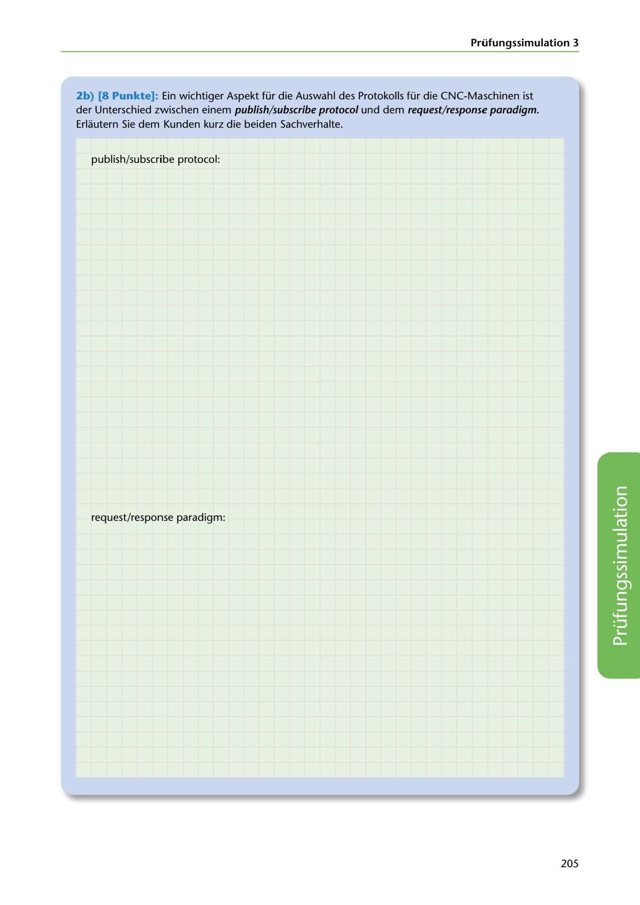

---
## Page 207
---

Prüfungssimulation 3

2b) [8 Punkte): Ein wichtiger Aspekt für die Auswahl des Protokolls für die CNC-Maschinen ist der Unterschied zwischen einem publish/subscribe protoco/ und dem request/response paradigm. Erlautern Sie dem Kunden kurz die beiden Sachverhalte.

publish/subscribe protocol:

request/response paradigm:

<!-- IMAGE: page-207-img-1.jpeg - TODO: Add description -->

205
