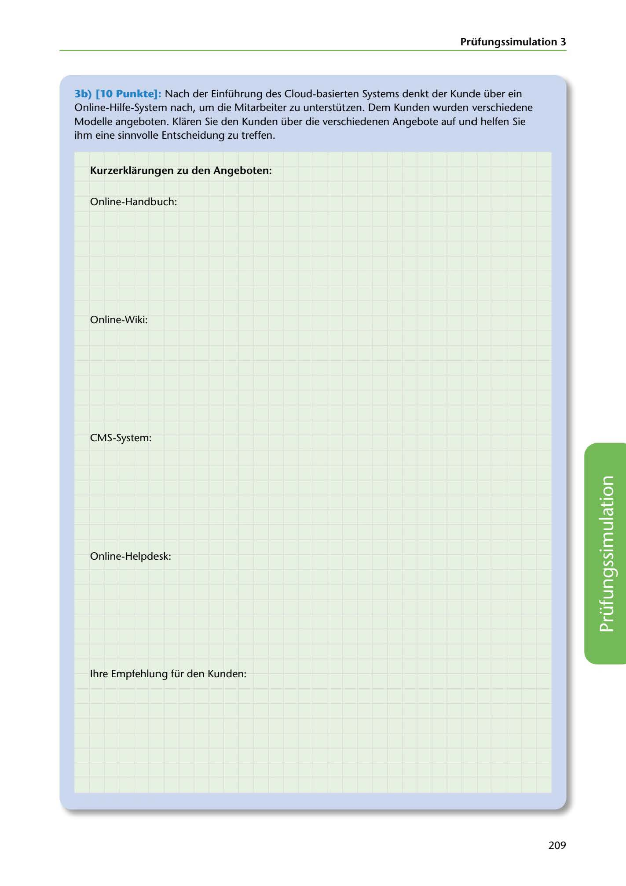

---
## Page 211
---

### Prüfungssimulation 3

3b) (10 Punkte): Nach der Einführung des Cloud-basierten Systems denkt der Kunde über ein Online-Hilfe-System nach, um die Mitarbeiter zu unterstützen. Dem Kunden wurden verschiedene Modelle angeboten. Klaren Sie den Kunden über die verschiedenen Angebote auf und helfen Sie ihm eine sinnvolle Entscheidung zu treffen.

### Kurzerklarungen zu den Angeboten:

Online-Handbuch:

Online-Wiki:

CMS-System:

Online-Helpdesk:

<!-- IMAGE: page-211-img-1.jpeg - TODO: Add description -->

lhre Empfehlung für den Kunden:

209
