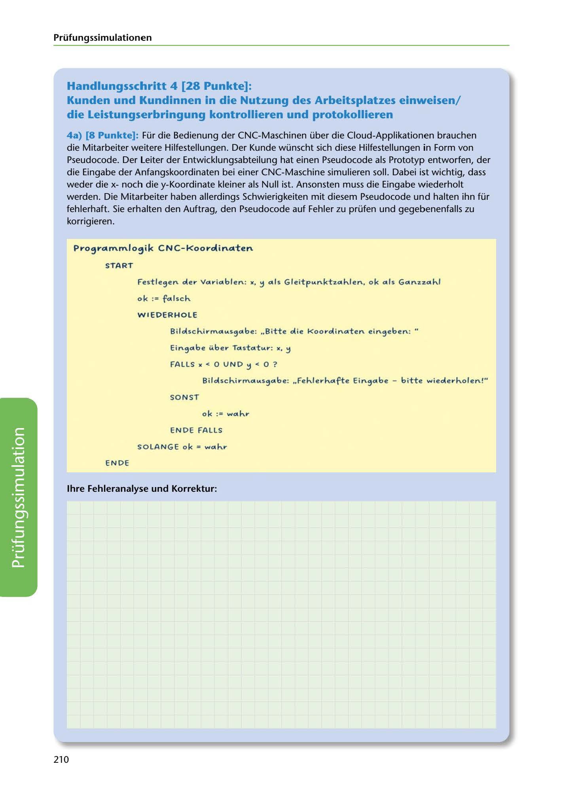

---
## Page 212
---

Prüfungssimulationen

## Handlungsschritt 4 [28 Punkte]:

### die Leistungserbringung kontrollieren und protokollieren

Kunden und Kundinnen in die Nutzung des Arbeitsplatzes einweisen/

4a) [8 Punkte]: Für die Bedienung der CNC-Maschinen über die Cloud-Applikationen brauchen die Mitarbeiter weitere Hilfestellungen. Der Kunde wünscht sich diese Hilfestellungen in Form van Pseudocode. Der Leiter der Entwicklungsabteilung hat einen Pseudocode als Prototyp entworfen, der die Eingabe der Anfangskoordinaten bei einer CNC-Maschine simulieren soll. Dabei ist wichtig, dass weder die xnoch die y-Koordinate kleiner als Null ist. Ansonsten muss die Eingabe wiederholt werden. Die Mitarbeiter haben allerdings Schwierigkeiten mit diesem Pseudocode und halten ihn für fehlerhaft. Sie erhalten den Auftrag, den Pseudocode auf Fehler zu prüfen und gegebenenfalls zu korrigieren.

### P..-o~..-arnm.lo~ik C N C-Koo..-dinaten

### START

Festle,en oler Vo11·i01blen: "• !:l 01ls Gleitp .... nktz.a1h.len, ok 011s G01nz.z.01h.l

### ok := f01lsch.

### W I EDERHO LE

Bilolsch.i;-m01 .... s,a1be: .,Bitte olie Koo;-olin01ten ein,eben: "

Ein,01be i.i.be,- T01sta1t .... r : "• !:l

FALLS " < O U N D !:l < O ?

Bilolsch.i;-m01 .... s,01be: .. Feh.le,-h.01~e Eirt,01be - bitte wieole;-h.olen!"

SON ST

ok := wa1h.;-

ENDE FALLS

SOLANGE ok = w01h.,-

EN DE

lhre Fehleranalyse und Korrektur:

<!-- IMAGE: page-212-img-1.jpeg - TODO: Add description -->

210
