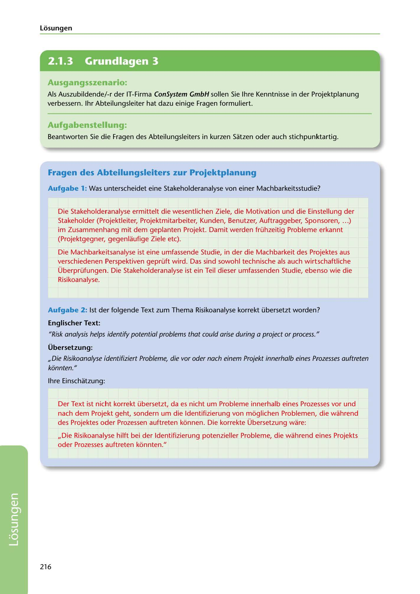

---
## Page 218
---

Losungen

<!-- IMAGE: page-218-img-1.jpeg - TODO: Add description -->

## Ausgangsszenario:

Als Auszubildende/ -r der IT-Firma ConSystem GmbH sallen Sie lhre Kenntnisse in der Projektplanung verbessern. 1hr Abteilungsleiter hat dazu einige Fragen formuliert.

## Aufgabenstellung:

Beantworten Sie die Fragen des Abteilungsleiters in kurzen Satzen oder auch stichpunktartig.

## Fragen des Abteilungsleiters zur Projektplanung

Aufgabe 1: Was unterscheidet eine Stakeholderanalyse von einer Machbarkeitsstudie?

Die Stakeholderanalyse ermittelt die wesentlichen Ziele, die Motivation und die Einstellung der Stakeholder (Projektleiter, Projektmitarbeiter, Kunden, Benutzer, Auftraggeber, Sponsoren, ... ) im Zusammenhang mit dem geplanten Projekt. Damit werden frühzeitig Probleme erkannt (Projektgegner, gegenlaufige Ziele etc).

Die Machbarkeitsanalyse ist eine umfassende Studie, in der die Machbarkeit des Projektes aus verschiedenen Perspektiven geprüft wird. Das sind sowohl technische als auch wirtschaftliche

Überprüfungen. Die Stakeholderanalyse ist ein Teil dieser umfassenden Studie, ebenso wie die Risikoanalyse.

Aufgabe 2: 1st der folgende Text zum Thema Risikoanalyse korrekt übersetzt worden?

### Englischer Text:

"Risk analysis helps identify potential problems that cou/d arise during a project or process."

### Übersetzung:

,,Die Risikoanalyse identifiziert Probleme, die vor oder nach einem Projekt innerha/b eines Prozesses auftreten konnten."

lhre Einschatzung:

Der Text ist nicht korrekt übersetzt, da es nicht um Probleme innerhalb eines Prozesses vor und nach dem Projekt geht, sondern um die ldentifizierung von moglichen Problemen, die wahrend des Projektes oder Prozessen auftreten konnen. Die korrekte Übersetzung ware:

,,Die Risikoanalyse hilft bei der ldentifizierung potenzieller Probleme, die wahrend eines Projekts oder Prozesses auftreten konnten."

216

**[VISUAL: CONSYSTEM GMBH SOLUTION HEADER]**
Header image for the ConSystem GmbH project planning solutions section.
