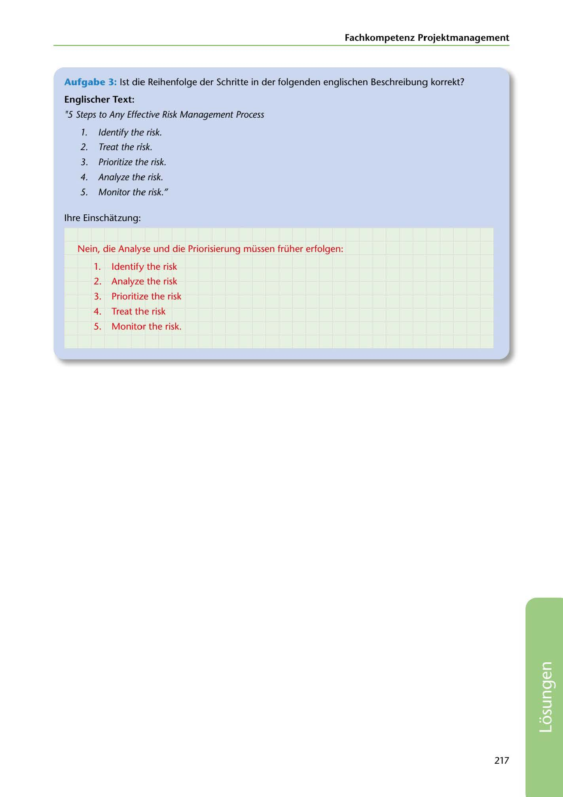

---
## Page 219
---

### Fachkompetenz Projektmanagement

Aufgabe 3: 1st die Reihenfolge der Schritte in der folgenden englischen Beschreibung korrekt?

### Englischer Text:

115 Steps to Any Effective Risk Management Process

7. ldentify the risk.

2. Treat the risk.

3. Prioritize the risk.

4. Analyze the risk.

5. Monitor the risk."

### lhre Einschatzung:

Nein, die Analyse und die Priorisierung müssen früher erfolgen:

### 1.

ldentify the risk 2. Analyze the risk 3. Prioritize the risk 4. Treat the risk 5. Monitor the risk.

217

<!-- IMAGE: page-219-img-1.jpeg - TODO: Add description -->
