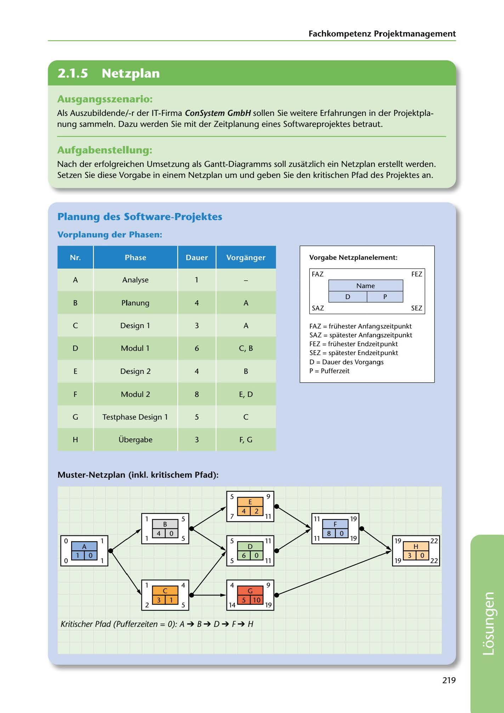

---
## Page 221
---

Fachkompetenz Projektmanagement

<!-- IMAGE: page-221-img-1.jpeg - TODO: Add description -->

## Ausgangsszenario:

Als Auszubildende/-r der IT-Firma ConSystem GmbH sallen Sie weitere Erfahrungen in der Projektpla- nung sammeln. Dazu werden Sie mit der Zeitplanung eines Softwareprojektes betraut.

## Aufgabenstellung:

Nach der erfolgreichen Umsetzung als Gantt-Diagramms soll zusatzlich ein Netzplan erstellt werden. Setzen Sie diese Vorgabe in einem Netzplan um und geben Sie den kritischen Pfad des Projektes an.

## Planung des Software-Projektes

### Vorgabe Netzplanelement:

### Vorganger

FAZ FEZ

Name

### Vorplanung der Phasen:

# -

# Phase -

### A

Analyse

D p

### B

Planung 4

### A

SAZ SEZ

A

## e

Design 1 3

C, B

D Modul 1 6

FAZ = frühester Anfangszeitpunkt SAZ= spatester Anfangszeitpunkt FEZ = frühester Endzeitpunkt SEZ = spatester Endzeitpunkt D = Dauer des Vorgangs P = Pufferzeit

B

E Design 2 4

E, D

### F

Modul 2 8

G Testphase Design 1 5

## e

F, G

H Übergabe 3

### Muster-Netzplan (inkl. kritischem Pfad):

# 5 5±i3 9

2 7 11

11 Etli3 19

l ~ S

**[VISUAL: NETWORK PLAN DIAGRAM WITH CRITICAL PATH - SOLUTION]**
Completed network plan diagram showing all project phases (A-H) with calculated earliest/latest start times (FAZ/SAZ) and earliest/latest end times (FEZ/SEZ). The critical path A → B → D → F → H is highlighted, representing tasks with zero buffer time that determine the minimum project duration of 22 time units.

11 8 O 19

19 ~ 22

S Edi3 11

19 3 O 22

### 0 5=@ 1

### o 1 o 1

1 4 o s

6 O 5 11

# 1 5E 4

**[VISUAL: NETWORK PLAN DIAGRAM WITH CRITICAL PATH - SOLUTION]**
Completed network plan diagram showing all project phases (A-H) with calculated earliest/latest start times (FAZ/SAZ) and earliest/latest end times (FEZ/SEZ). The critical path A → B → D → F → H is highlighted, representing tasks with zero buffer time that determine the minimum project duration of 22 time units.

2 3 1 s

# J

4 9 5110 119

Kritischer Pfad (Pufferzeiten = O): A ➔ B ➔ D ➔ F ➔ H

219

**[VISUAL: NETWORK PLAN DIAGRAM WITH CRITICAL PATH - SOLUTION]**
Completed network plan diagram showing all project phases (A-H) with calculated earliest/latest start times (FAZ/SAZ) and earliest/latest end times (FEZ/SEZ). The critical path A → B → D → F → H is highlighted, representing tasks with zero buffer time that determine the minimum project duration of 22 time units.
