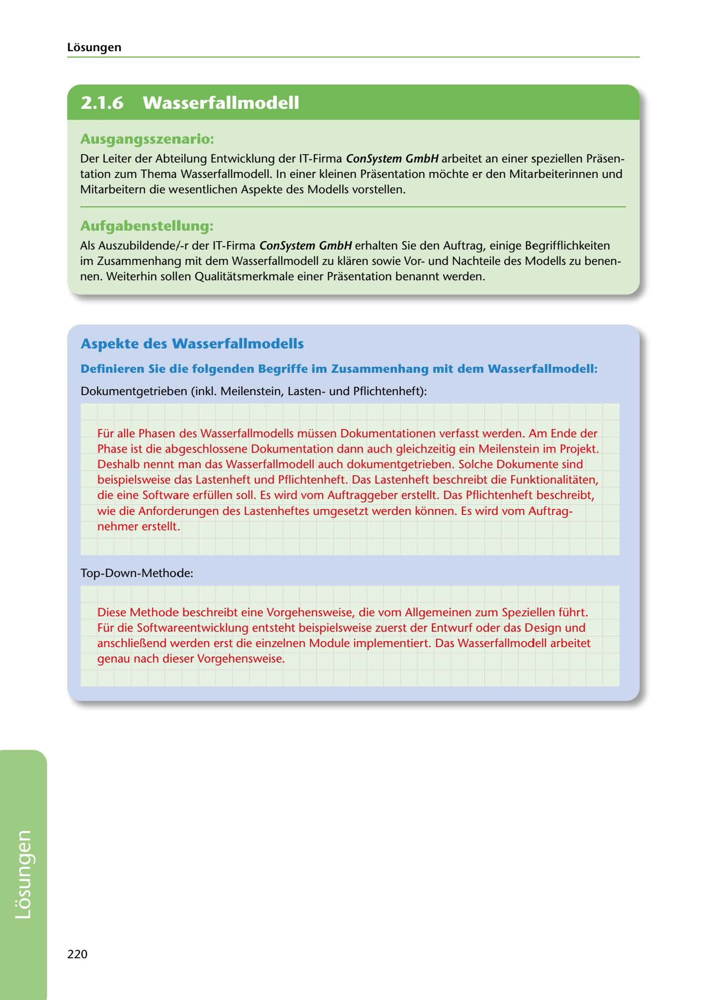

---
## Page 222
---

Losungen

<!-- IMAGE: page-222-img-1.jpeg - TODO: Add description -->

**[VISUAL: CONSYSTEM GMBH SOLUTION HEADER]**
Header image for the ConSystem GmbH waterfall model solutions section.

## Ausgangsszenario:

Der Leiter der Abteilung Entwicklung der IT-Firma ConSystem GmbH arbeitet an einer speziellen Prasen- tation zum Thema Wasserfallmodell. In einer kleinen Prasentation mochte er den Mitarbeiterinnen und Mitarbeitern die wesentlichen Aspekte des Modells vorstellen.

## Aufgabenstellung:

Als Auszubildende/-r der IT-Firma ConSystem GmbH erhalten Sie den Auftrag, einige Begrifflichkeiten im Zusammenhang mit dem Wasserfallmodell zu klaren sowie Vorund Nachteile des Modells zu benen- nen. Weiterhin sallen Qualitatsmerkmale einer Prasentation benannt werden.

## Aspekte des Wasserfallmodells

Definieren Sie die folgenden Begriffe im Zusammenhang mit dem Wasserfallmodell:

Dokumentgetrieben (inkl. Meilenstein, Lastenund Pflichtenheft):

Für alle Phasen des Wasserfallmodells müssen Dokumentationen verfasst werden. Am Ende der Phase ist die abgeschlossene Dokumentation dann auch gleichzeitig ein Meilenstein im Projekt. Deshalb nennt man das Wasserfallmodell auch dokumentgetrieben. Solche Dokumente sind beispielsweise das Lastenheft und Pflichtenheft. Das Lastenheft beschreibt die Funktionalitaten, die eine Software erfüllen soll. Es wird vom Auftraggeber erstellt. Das Pflichtenheft beschreibt, wie die Anforderungen des Lastenheftes umgesetzt werden konnen. Es wird vom Auftrag- nehmer erstellt.

Top-Down-Methode:

Diese Methode beschreibt eine Vorgehensweise, die vom Allgemeinen zum Speziellen führt. Für die Softwareentwicklung entsteht beispielsweise zuerst der Entwurf oder das Design und anschlie!1end werden erst die einzelnen Module implementiert. Das Wasserfallmodell arbeitet genau nach dieser Vorgehensweise.

220

**[VISUAL: CONSYSTEM GMBH SOLUTION HEADER]**
Header image for the ConSystem GmbH waterfall model solutions section.
