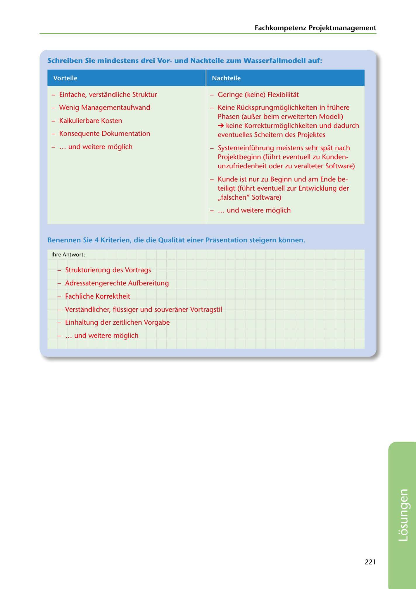

---
## Page 223
---

Fachkompetenz Projektmanagement

Schreiben Sie mindestens drei Vorund Nachteile zum Wasserfallmodell auf:

### Vorteile

### Nachteile

- Einfache, verstandliche Struktur

- Geringe (keine) Flexibilitat

- Wenig Managementaufwand

- Keine Rücksprungméiglichkeiten in frühere Phasen (aur..er beim erweiterten Modell)

- Kalkulierbare Kosten

- Konsequente Dokumentation

➔ keine Korrekturméiglichkeiten und dadurch eventuelles Scheitern des Projektes

- ... und weitere méiglich

Systemeinführung meistens sehr spat nach Projektbeginn (führt eventuell zu Kunden- unzufriedenheit oder zu veralteter Software)

- Kunde ist nur zu Beginn und am Ende be- teiligt (führt eventuell zur Entwicklung der ,,falschen" Software)

- ... und weitere méiglich

Benennen Sie 4 Kriterien, die die Qualitat einer Prasentation steigern konnen.

lhre Antwort:

- Strukturierung des Vortrags

- Adressatengerechte Aufbereitung

- Fachliche Korrektheit

- Verstandlicher, flüssiger und souveraner Vortragstil

- Einhaltung der zeitlichen Vorgabe

- ... und weitere méiglich

221

<!-- IMAGE: page-223-img-1.jpeg - TODO: Add description -->
