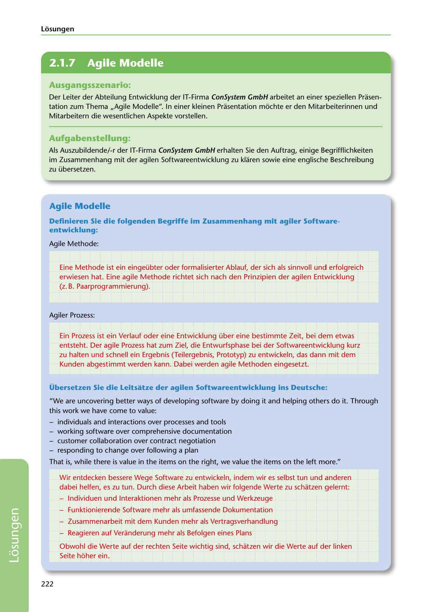

---
## Page 224
---

### Losungen

<!-- IMAGE: page-224-img-1.jpeg - TODO: Add description -->

### Ausgangsszenario:

Der Leiter der Abteilung Entwicklung der IT-Firma ConSystem GmbH arbeitet an einer speziellen Prasen- tation zum Thema ,,Agile Modelle". In einer kleinen Prasentation mochte er den Mitarbeiterinnen und Mitarbeitern die wesentlichen Aspekte vorstellen.

### Aufgabenstellung:

Als Auszubildende/-r der IT-Firma ConSystem GmbH erhalten Sie den Auftrag, einige Begrifflichkeiten im Zusammenhang mit der agilen Softwareentwicklung zu klaren sowie eine englische Beschreibung zu übersetzen.

### Agile Modelle

### entwicklung:

Definieren Sie die folgenden Begriffe im Zusammenhang mit agiler Software-

Agile Methode:

Eine Methode ist ein eingeübter oder formalisierter Ablauf, der sich als sinnvoll und erfolgreich erwiesen hat. Eine agile Methode richtet sich nach den Prinzipien der agilen Entwicklung (z. B. Paarprogrammierung).

Agiler Prozess:

Ein Prozess ist ein Verlauf oder eine Entwicklung über eine bestimmte Zeit, bei dem etwas entsteht. Der agile Prozess hat zum Ziel, die Entwurfsphase bei der Softwareentwicklung kurz zu halten und schnell ein Ergebnis (Teilergebnis, Prototyp) zu entwickeln, das dann mit dem Kunden abgestimmt werden kann. Dabei werden agile Methoden eingesetzt.

Übersetzen Sie die Leitsatze der agilen Softwareentwicklung ins Deutsche:

"We are uncovering better ways of developing software by doing it and helping others do it. Through this work we have come to value:

- individuals and interactions over processes and tools - working software over comprehensive documentation - customer collaboration over contract negotiation - responding to change over following a plan

That is, w hile there is value in the items on the right, we value the items on the left more."

Wir entdecken lbessere Wege Software zu entwickeln, indem wir es selbst tun und anderen dabei helfen, es zu tun. Durch diese Arbeit haben wir folgende Werte zu schatzen gelernt:

- Individuen und lnteraktionen mehr als Prozesse und Werkzeuge

- Funktionierende Software mehr als umfassende Dokumentation

- Zusammenarbeit mit dem Kunden mehr als Vertragsverhandlung

- Reagieren auf Veranderung mehr als Befolgen eines Plans

Obwohl die Werte auf der rechten Seite wichtig sind, schatzen wir die Werte auf der linken Seite hoher ein.

222

**[VISUAL: CONSYSTEM GMBH SOLUTION HEADER]**
Header image for the ConSystem GmbH agile development models solutions section.
