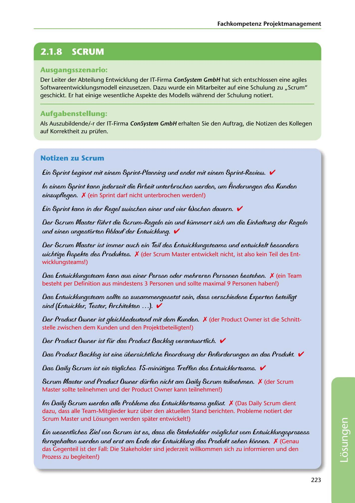

---
## Page 225
---

### Fachkompetenz Projektmanagement

# 2.1.8 SCRUM

### Ausgangsszenario:

Der Leiter der Abteilung Entwicklung der IT-Firma ConSystem GmbH hat sich entschlossen eine agiles Softwareentwicklungsmodell einzusetzen. Dazu wurde ein Mitarbeiter auf eine Schulung zu ,,Scrum" geschickt. Er hat einige wesentliche Aspekte des Modells wahrend der Schulung notiert.

### Aufgabenstellung:

Als Auszubildende/-r der IT-Firma ConSystem GmbH erhalten Sie den Auftrag, die Notizen des Kollegen auf Korrektheit zu prüfen.

### Notizen zu Scrum

E in Sprint heginnf mif einem Sprint-Pfanning und endef mif einem Sprint-Review. v'

In einem Sprint kann jederzeif die Arheif unferhrochen werden, um Anderungen des Kunden

einzupffegen. X (ein Sprint darf nicht unterbrochen werden!)

fin Sprint kann in der Regef zwischen einer und vier {Jjoc,hen dauern. v'

### und einen ungestorfen A6/auf der Entwickfung. v'

IJer Scrum Master führf die Scrum-Regef n ein und l<ümmerf sích um die finhaffung der Regef n

IJer Scrum Master ist ímmer auch ein Íeif des E nfwiddungsteams und enfwickeft 6esonders

wíchfíge Aspekfe des Produf<fes. X (der Scrum Master entwickelt nicht, ist also kein Teil des Ent- wicklungsteams!)

IJas Entwickfungsteam kann aus einer Person oder mehreren Personen 6estehen. X (ein Team besteht per Definition aus mindestens 3 Personen und sollte maximal 9 Personen haben!)

### sind (Entwickler, Íesfer, Archífef<fen .. . ). v'

IJas Entwickfungsteam sofffe so zusammengesefzf sein, dass verschiedene Experlen 6eteifígt

IJer Producf Dwner isf 9feich6edeufend mif dem Kunden. X (der Product Owner ist die Schnitt- stelle zwischen dem Kunden und den Projektbeteiligten!)

IJer Producf Dwner isf für das Producf 8ackfog veranfworffich. v'

IJas Producf 8acl<fog isf eine ü6ersichffiche Anordnung der Anforderungen an das Produl<t. v'

IJas IJaífy Scrum isf ein tiigfiches fS-minüfíges íreffe.n des Entwickferfeams. v'

Scrum Master und Producf Dwner dürfen nichf am IJaify Scrum feifnehmen. X (der Scrum Master sollte teilnehmen und der Product Owner kann teilnehmen!)

lm IJaify Scrum Merden affe Pro6/eme des Entwickferfeams gefosf. X (Das Daily Scrum dient dazu, dass alle Team-Mitglieder kurz über den aktuellen Stand berichten. Probleme notiert der Scrum Master und Losungen werden spater entwickelt!)

fin wesenffiches Zief von Scrum ist es, dass die Stal<eholder moglichst vom Entwícl<fungsprozess

ferngehaffen werden und ersf am Ende der Entwickfung das Produf<f sehen konnen. X (Genau das Gegenteil ist der Fall: Die Stakeholder sind jederzeit willkommen sich zu informieren und den Prozess zu begleiten!)

223

<!-- IMAGE: page-225-img-1.jpeg - TODO: Add description -->
