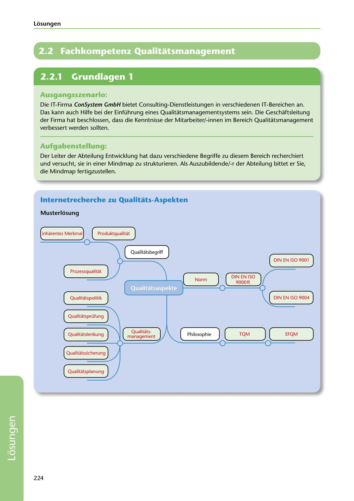

---
## Page 226
---

Losungen

# 2.2 Fachkompetenz Qualitatsmanagement

<!-- IMAGE: page-226-img-1.jpeg - TODO: Add description -->

**[VISUAL: QUALITY MANAGEMENT MINDMAP - SOLUTION]**
Completed mindmap showing quality management concepts with branches for: Qualitätsbegriff (quality concept), DIN EN ISO 9000ff standards, product quality (inherent characteristics), process quality, quality policy, quality management (TQM/EFQM philosophy), quality assurance, quality planning, quality control, and quality inspection.

## Ausgangsszenario:

Die IT-Firma ConSystem GmbH bietet Consulting-Dienstleistungen in verschiedenen IT-Bereichen an. Das kann auch Hilfe bei der Einführung eines Qualitatsmanagementsystems sein. Die Geschaftsleitung der Firma hat beschlossen, dass die Kenntnisse der Mitarbeiter/-innen im Bereich Qualitatsmanagement verbessert werden sollten.

## Aufgabenstellung:

Der Leiter der Abteilung Entwicklung hat dazu verschiedene Begriffe zu diesem Bereich recherchiert und versucht, sie in einer Mindmap zu strukturieren. Als Auszubildende/-r der Abteilung bittet er Sie, die Mindmap fertigzustellen.

## lnternetrecherche zu Qualitats-Aspekten

### Musterlosung

inharentes Merkmal Produktqualitat

**[VISUAL: QUALITY MANAGEMENT MINDMAP - SOLUTION]**
Completed mindmap showing quality management concepts with branches for: Qualitätsbegriff (quality concept), DIN EN ISO 9000ff standards, product quality (inherent characteristics), process quality, quality policy, quality management (TQM/EFQM philosophy), quality assurance, quality planning, quality control, and quality inspection.

Qualitatsbegríff

( DIN EN ISO 9001 )

Prozessqualitat

DIN EN ISO 9000ft.

Qualitatspolitik

**[VISUAL: QUALITY MANAGEMENT MINDMAP - SOLUTION]**
Completed mindmap showing quality management concepts with branches for: Qualitätsbegriff (quality concept), DIN EN ISO 9000ff standards, product quality (inherent characteristics), process quality, quality policy, quality management (TQM/EFQM philosophy), quality assurance, quality planning, quality control, and quality inspection.

Qualitatsprüfung

# ~======~=====---

Qualitatslenkung Qualitats- management ( Philosophie ) ( TQM ) ( EFQM )

Qualitatssicherung

Qualitatsplanung

**[VISUAL: QUALITY MANAGEMENT MINDMAP - SOLUTION]**
Completed mindmap showing quality management concepts with branches for: Qualitätsbegriff (quality concept), DIN EN ISO 9000ff standards, product quality (inherent characteristics), process quality, quality policy, quality management (TQM/EFQM philosophy), quality assurance, quality planning, quality control, and quality inspection.

224

**[VISUAL: QUALITY MANAGEMENT MINDMAP - SOLUTION]**
Completed mindmap showing quality management concepts with branches for: Qualitätsbegriff (quality concept), DIN EN ISO 9000ff standards, product quality (inherent characteristics), process quality, quality policy, quality management (TQM/EFQM philosophy), quality assurance, quality planning, quality control, and quality inspection.
