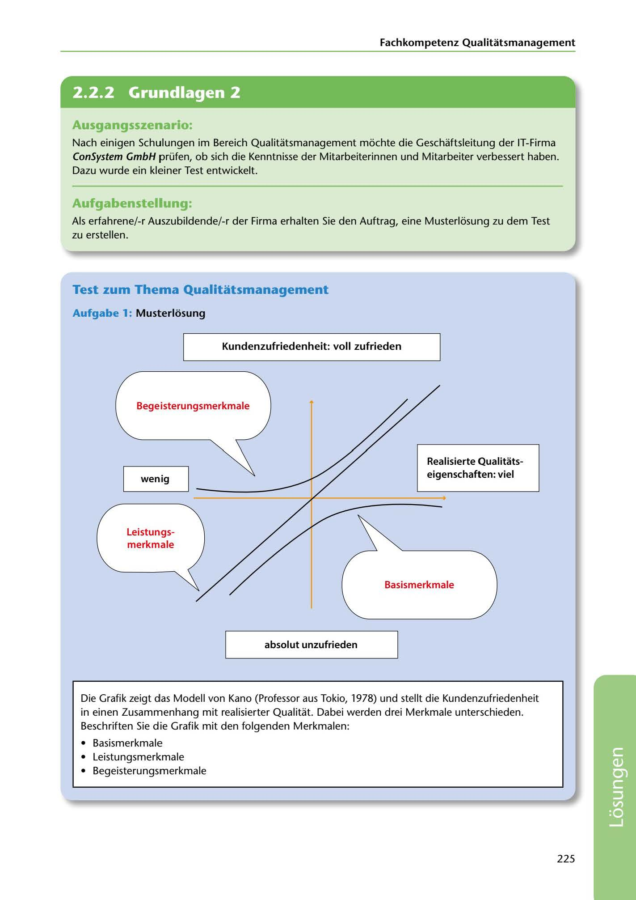

---
## Page 227
---

Fachkompetenz Qualitatsmanagement

<!-- IMAGE: page-227-img-1.jpeg - TODO: Add description -->

**[VISUAL: KANO MODEL DIAGRAM - SOLUTION]**
Completed Kano model diagram showing customer satisfaction (vertical axis) vs. realized quality characteristics (horizontal axis). The diagram shows three labeled curves: Basismerkmale (basic requirements), Leistungsmerkmale (performance requirements), and Begeisterungsmerkmale (excitement features), demonstrating how different quality aspects affect customer satisfaction differently.

## Ausgangsszenario:

Nach einigen Schulungen im Bereich Qualitatsmanagement mochte die Geschaftsleitung der IT-Firma ConSystem GmbH prüfen, ob sich die Kenntnisse der Mitarbeiterinnen und Mitarbeiter verbessert haben. Dazu wurde ein kleiner Test entwickelt.

## Aufgabenstellung:

Als erfahrene/-r Auszubildende/-r der Firma erhalten Sie den Auftrag, eine Musterlosung zu dem Test zu erstellen.

## Test zum Thema Qualitatsmanagement

### Aufgabe 1: Musterlósung

Kundenzufriedenheit: voll zufrieden

### t

Begeisterungsmerkmale

### Realisierte Qualitats-

### eigenschaften: viel

### wenig

### Leistungs-

### merkmale

### Basismerkmale

**[VISUAL: KANO MODEL DIAGRAM - SOLUTION]**
Completed Kano model diagram showing customer satisfaction (vertical axis) vs. realized quality characteristics (horizontal axis). The diagram shows three labeled curves: Basismerkmale (basic requirements), Leistungsmerkmale (performance requirements), and Begeisterungsmerkmale (excitement features), demonstrating how different quality aspects affect customer satisfaction differently.

### absolut unzufrieden

Die Grafik zeigt das Modell von Kano (Professor aus Tokio, 1978) und stellt die Kundenzufriedenheit in einen Zusammenhang mit realisierter Qualitat. Dabei werden drei Merkmale unterschieden. Beschriften Sie die Grafik mit den folgenden Merkmalen:

• Basismerkmale • Leistungsmerkmale • Begeisterungsmerkmale

225

**[VISUAL: KANO MODEL DIAGRAM - SOLUTION]**
Completed Kano model diagram showing customer satisfaction (vertical axis) vs. realized quality characteristics (horizontal axis). The diagram shows three labeled curves: Basismerkmale (basic requirements), Leistungsmerkmale (performance requirements), and Begeisterungsmerkmale (excitement features), demonstrating how different quality aspects affect customer satisfaction differently.
