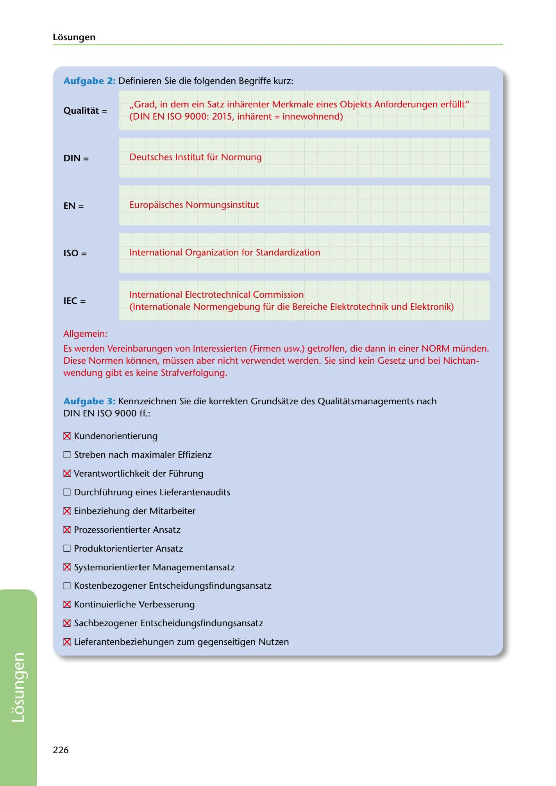

---
## Page 228
---

Losungen

### Aufgabe 2: Definieren Sie die folgenden Begriffe kurz:

### Qualitat =

,,Grad, in dem ein Satz inharenter Merkmale eines Objekts Anforderungen erfüllt" (DIN EN ISO 9000: 2015, inharent = innewohnend)

Deutsches lnstitut für Normung

### DIN =

Europaisches Normungsinstitut

### EN =

lnternational Organization far Standardization

### ISO =

### IEC =

lnternational Electrotechnical Commission (lnternationale Normengebung für die Bereiche Elektrotechnik und Elektronik)

Allgemein:

Es werden Vereinbarungen van lnteressierten (Firmen usw.) getroffen, die dann in einer NORM münden. Diese Normen konnen, müssen aber nicht verwendet werden. Sie sind kein Gesetz und bei Nichtan- wendung gibt es keine Strafverfolgung.

Aufgabe 3: Kennzeichnen Sie die korrekten Grundsatze des Qualitatsmanagements nach DIN EN ISO 9000 ff.:

181 Kundenorientierung

O Streben nach maximaler Effizienz

181 Verantwortlichkeit der Führung

O Durchführung eines Lieferantenaudits

181 Einbeziehung der Mitarbeiter

181 Prozessorientierter Ansatz

O Produktorientierter Ansatz

181 Systemorientierter Managementansatz

O Kostenbezogener Entscheidungsfindungsansatz

181 Kontinuierliche Verbesserung

181 Sachbezogener Entscheidungsfindungsansatz

181 Lieferantenbeziehungen zum gegenseitigen Nutzen

226

<!-- IMAGE: page-228-img-1.jpeg - TODO: Add description -->
