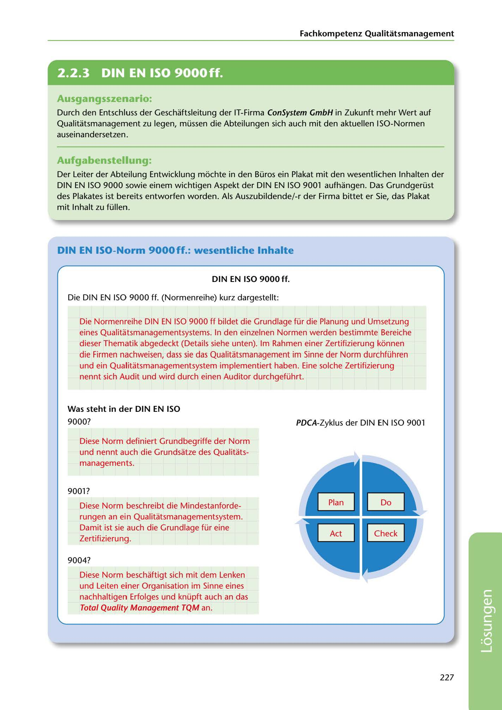

---
## Page 229
---

Fachkompetenz Qualitatsmanagement

<!-- IMAGE: page-229-img-1.jpeg - TODO: Add description -->

**[VISUAL: DIN EN ISO 9000ff POSTER WITH PDCA CYCLE - SOLUTION]**
A completed informational poster showing the DIN EN ISO 9000ff quality management standards. Includes descriptions of ISO 9000 (basic terms and principles), ISO 9001 (minimum requirements and PDCA cycle diagram), and ISO 9004 (sustainable success and TQM connection). The PDCA cycle (Plan-Do-Check-Act) is shown as a circular diagram.

### Ausgangsszenario:

Durch den Entschluss der Geschaftsleitung der IT-Firma ConSystem GmbH in Zukunft mehr Wert auf Qualitatsmanagement zu legen, müssen die Abteilungen sich auch mit den aktuellen ISO-Normen auseinandersetzen.

### Aufgabenstellung:

Der Leiter der Abteilung Entwicklung mochte in den Büros ein Plakat mit den wesentlichen lnhalten der DIN EN ISO 9000 sowie einem wichtigen Aspekt der DIN EN ISO 9001 aufhangen. Das Grundgerüst des Plakates ist bereits entworfen worden. Als Auszubildende/-r der Firma bittet er Sie, das Plakat mit lnhalt zu füllen.

## DIN EN ISO-Norm 9000ff.: wesentliche lnhalte

### DIN EN ISO 9000 ff.

Die DIN EN ISO 9000 ff. (Normenreihe) kurz dargestellt:

Die Normenreihe DIN EN ISO 9000 ff bildet die Grundlage für die Planung und Umsetzung eines Qualitatsmanagementsystems. In den einzelnen Normen werden bestimmte Bereiche dieser Thematik abgedeckt (Details siehe unten). lm Rahmen einer Zertifizierung l<onnen die Firmen nachweisen, dass sie das Qualitatsmanagement im Sinne der Norm durchführen und ein Qualitatsmanagementsystem implementiert haben. Eine solche Zertifizierung nennt sich Audit und wird durch einen Auditor durchgeführt.

### Was steht in der DIN EN ISO

9000?

PDCA-Zyklus der DIN EN ISO 9001

Diese Norm definiert Grundbegriffe der Norm und nennt auch die Grundsatze des Qualitats- managements.

9001?

Diese Norm beschreibt die Mindestanforde- rungen an ein Qualitatsmanagementsystem. Damit ist sie auch die Grundlage für eine Zertifizierung.

9004?

**[VISUAL: DIN EN ISO 9000ff POSTER WITH PDCA CYCLE - SOLUTION]**
A completed informational poster showing the DIN EN ISO 9000ff quality management standards. Includes descriptions of ISO 9000 (basic terms and principles), ISO 9001 (minimum requirements and PDCA cycle diagram), and ISO 9004 (sustainable success and TQM connection). The PDCA cycle (Plan-Do-Check-Act) is shown as a circular diagram.

### Total Quality Management TQM an.

Diese Norm beschaftigt sich mit dem Lenken und Leiten einer Organisation im Sinne eines nachhaltigen Erfolges und knüpft auch an das

227

**[VISUAL: DIN EN ISO 9000ff POSTER WITH PDCA CYCLE - SOLUTION]**
A completed informational poster showing the DIN EN ISO 9000ff quality management standards. Includes descriptions of ISO 9000 (basic terms and principles), ISO 9001 (minimum requirements and PDCA cycle diagram), and ISO 9004 (sustainable success and TQM connection). The PDCA cycle (Plan-Do-Check-Act) is shown as a circular diagram.
