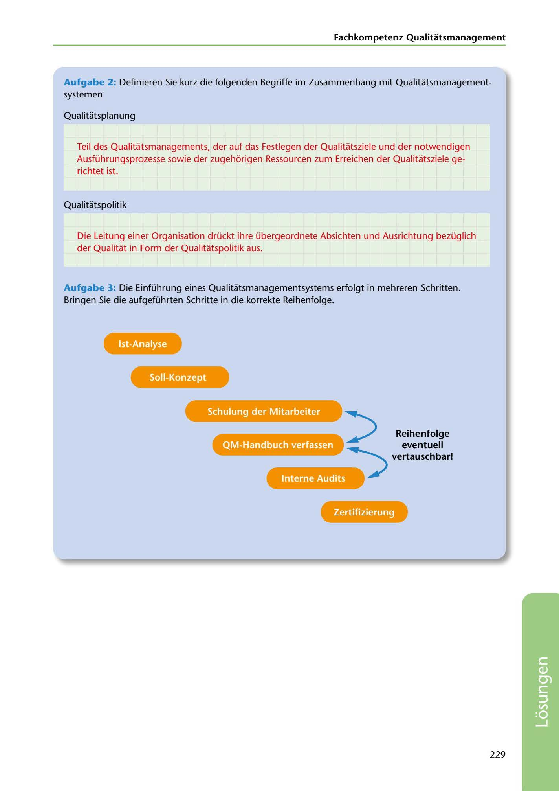

---
## Page 231
---

Fachkompetenz Qualitatsmanagement

Aufgabe 2: Definieren Sie kurz die folgenden Begriffe im Zusammenhang mit Qualitatsmanagement- systemen

Qualitatsplanung

Teil des Qualitatsmanagements, der auf das Festlegen der Qualitatsziele und der notwendigen Ausführungsprozesse sowie der zugehorigen Ressourcen zum Erreichen der Qualitatsziele ge- richtet ist.

Qualitatspolitik

Die Leitung einer Organisation drückt ihre übergeordnete Absichten und Ausrichtung bezüglich der Qualitat in Form der Qualitatspolitik aus.

Aufgabe 3: Die Einführung eines Qualitatsmanagementsystems erfolgt in mehreren Schritten. Bringen Sie die aufgeführten Schritte in die korrekte Reihenfolge.

<!-- IMAGE: page-231-img-1.jpeg - TODO: Add description -->

Soll-Konzept

Schulung der Mitarbeiter

# QM-Handbuch verfassen ":>

### Reihenfolge

### eventuell

# ~

### vertauschbar!

Interne Audits

**[VISUAL: QMS IMPLEMENTATION SEQUENCE - SOLUTION]**
A flow diagram showing the correct sequence for implementing a quality management system: Soll-Konzept (target concept) → Schulung der Mitarbeiter (staff training) → QM-Handbuch verfassen (write QM handbook) → Interne Audits (internal audits). Notes indicate some steps may be interchangeable.

229

**[VISUAL: QMS IMPLEMENTATION SEQUENCE - SOLUTION]**
A flow diagram showing the correct sequence for implementing a quality management system: Soll-Konzept (target concept) → Schulung der Mitarbeiter (staff training) → QM-Handbuch verfassen (write QM handbook) → Interne Audits (internal audits). Notes indicate some steps may be interchangeable.
