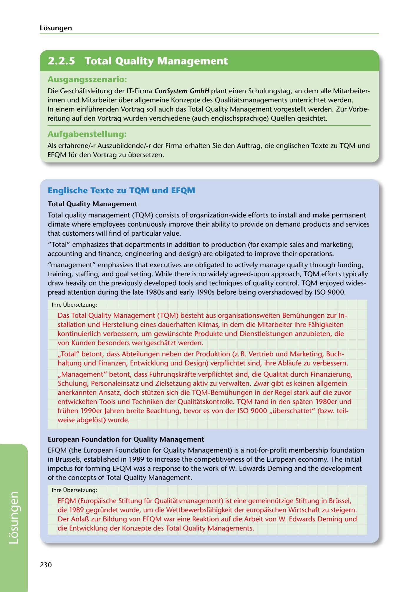

---
## Page 232
---

### Losungen

<!-- IMAGE: page-232-img-1.jpeg - TODO: Add description -->

**[VISUAL: CONSYSTEM GMBH SOLUTION HEADER]**
Header image for the ConSystem GmbH TQM and EFQM translation solutions section.

### Ausgangsszenario:

Die Geschaftsleitung der IT-Firma ConSystem GmbH plant einen Schulungstag, an dem alle Mitarbeiter- innen und Mitarbeiter über allgemeine Konzepte des Qualitatsmanagements unterrichtet werden. In einem einführenden Vortrag soll auch das Total Quality Management vorgestellt werden. Zur Vorbe- reitung auf den Vortrag wurden verschiedene (auch englischsprachige) Quellen gesichtet.

### Aufgabenstellung:

Als erfahrene/-r Auszubildende/-r der Firma erhalten Sie den Auftrag, die englischen Texte zu TQM und EFQM für den Vortrag zu übersetzen.

**[VISUAL: CONSYSTEM GMBH SOLUTION HEADER]**
Header image for the ConSystem GmbH TQM and EFQM translation solutions section.

### Englische Texte zu TQM und EFQM

### Total Quality Management

Total quality management (TQM) consists of organization-wide efforts to install and make permanent climate where employees continuously improve their ability to provide on demand products and services that customers will find of particular value.

"Total" emphasizes that departments in addition to production (for example sales and marketing, accounting and finance, engineering and design) are obligated to improve their operations.

"management" emphasizes that executives are obligated to actively manage quality through funding, training, staffing, and goal setting. While there is no widely agreed-upon approach, TQM efforts typically draw heavily on the previously developed tools and techniques of quality control. TQM enjoyed wides- pread attention during the late 1980s and early 1990s befare being overshadowed by ISO 9000.

lhre Übersetzung:

Das Total Quality Management (TQM) besteht aus organisationsweiten Bemühungen zur ln- stallation und Herstellung eines dauerhaften Klimas, in dem die Mitarbeiter ihre Fahigkeiten kontinuierlich verbessern, um gewünschte Produkte und Dienstleistungen anzubieten, die von Kunden besonders wertgeschatzt werden.

,,Total" betont, dass Abteilungen neben der Produktion (z. B. Vertrieb und Marketing, Buch- haltung und Finanzen, Entwicklung und Design) verpflichtet sind, ihre Ablaufe zu verbessern.

,,Management" betont, dass Führungskrafte verpflichtet sind, die Qualitat durch Finanzierung, Schulung, Personaleinsatz und Zielsetzung aktiv zu verwalten. Zwar gibt es keinen allgemein anerkannten Ansatz, doch stützen sich die TQM-Bemühungen in der Regel stark auf die zuvor entwickelten Tools und Techniken der Qualitatskontrolle. TQM fand in den spaten 1980er und frühen 1990er Jahren breite Beachtung, bevor es von der ISO 9000 ,,überschattet" (bzw. teil- weise abgelost) wurde.

### European Foundation for Quality Management

EFQM (the European Foundation for Quality Management) is a not-for-profit membership foundation in Brussels, established in 1989 to increase the competitiveness of the European economy. The initial impetus for forming EFQM was a response to the work of W. Edwards Deming and the development of the concepts of Total Quality Management.

lhre Übersetzung:

EFQM (Europais.che Stiftung für Qualitatsmanagement) ist eine gemeinnützige Stiftung in Brüssel, die 1989 gegründet wurde, um die Wettbewerbsfahigkeit der europaischen Wirtschaft zu steigern. Der Anlal1 zur Bildung von EFQM war eine Reaktion auf die Arbeit von W. Edwards Deming und die Entwicklung der Konzepte des Total Quality Managements.

230

**[VISUAL: CONSYSTEM GMBH SOLUTION HEADER]**
Header image for the ConSystem GmbH TQM and EFQM translation solutions section.
