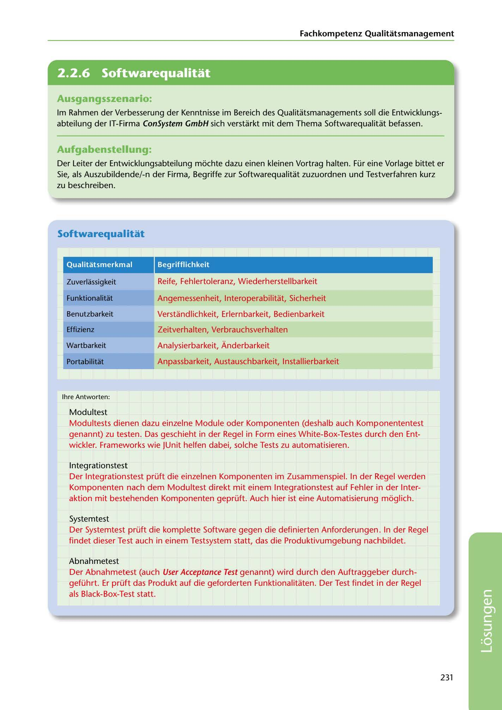

---
## Page 233
---

Fachkompetenz Qualitatsmanagement

<!-- IMAGE: page-233-img-1.jpeg - TODO: Add description -->

**[VISUAL: CONSYSTEM GMBH SOLUTION HEADER]**
Header image for the ConSystem GmbH software quality and testing solutions section.

## Ausgangsszenario:

lm Rahmen der Verbesserung der Kenntnisse im Bereich des Qualitatsmanagements soll die Entwicklungs- abteilung der IT-Firma ConSystem GmbH sich verstarkt mit dem Thema Softwarequalitat befassen.

## Aufgabenstellung:

Der Leiter der Entwicklungsabteilung mochte dazu einen kleinen Vortrag halten. Für eine Vorlage bittet er Sie, als Auszubildende/-n der Firma, Begriffe zur Softwarequalitat zuzuordnen und Testverfahren kurz zu beschreiben.

## Softwarequal itat

### Qualitatsmerkmal

### Begrifflichkeit

Reife, Fehlertoleranz, Wiederherstellbarkeit

Zuverlassigkeit

### Funktionalitat

Angemessenheit, lnteroperabilitat, Sicherheit

### Benutzbarkeit

Verstandlichkeit, Erlernbarkeit, Bedienbarkeit

### Effizienz

Zeitverhalten, Verbrauchsverhalten

### Wartbarkeit

Analysierbarkeit, Ánderbarkeit

Anpassbarkeit, Austauschbarkeit, lnstallierbarkeit

### Portabilitat

# ---------

lhre Antworten:

Modultest

Modultests dienen dazu einzelne Module oder Komponenten (deshalb auch Komponententest genannt) zu testen. Das geschieht in der Regel in Form eines White-Box-Testes durch den Ent- wickler. Frameworks wie JUnit helfen dabei, solche Tests zu automatisieren.

1 nteg rationstest Der lntegrationstest prüft die einzelnen Komponenten im Zusammenspiel. In der Regel werden Komponenten nach dem Modultest direkt mit einem lntegrationstest auf Fehler in der lnter- aktion mit bestehenden Komponenten geprüft. Auch hier ist eine Automatisierung moglich.

Systemtest Der Systemtest prüft die komplette Software gegen die definierten Anforderungen. In der Regel findet dieser Test auch in einem Testsystem statt, das die Produktivumgebung nachbildet.

Abnahmetest

Der Abnahmetest (auch User Acceptance Test genannt) wird durch den Auftraggeber durch- geführt. Er prüft das Produkt auf die geforderten Funktionalitaten. Der Test findet in der Regel als Black-Box-Test statt.

231

**[VISUAL: CONSYSTEM GMBH SOLUTION HEADER]**
Header image for the ConSystem GmbH software quality and testing solutions section.
