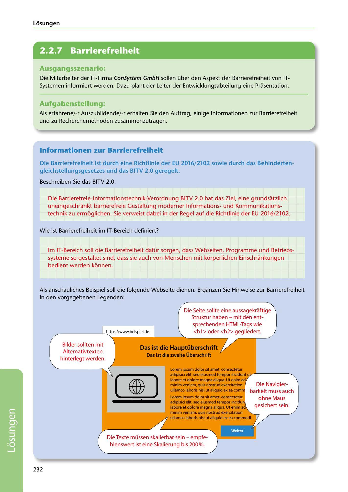

---
## Page 234
---

Losungen

<!-- IMAGE: page-234-img-1.jpeg - TODO: Add description -->

**[VISUAL: WEBSITE ACCESSIBILITY EXAMPLE WITH ANNOTATIONS - SOLUTION]**
An annotated example webpage demonstrating accessibility requirements. Callouts point to: proper HTML heading structure (h1, h2 tags), alternative text for images, keyboard navigation support, and text scalability up to 200%. The sample website shows Lorem ipsum placeholder text with proper semantic markup.

## Ausgangsszenario:

Die Mitarbeiter der IT-Firma ConSystem GmbH sallen über den Aspekt der Barrierefreiheit van IT- Systemen informiert werden. Dazu plant der Leiter der Entwicklungsabteilung eine Prasentation.

## Aufgabenstellung:

Als erfahrene/-r Auszubildende/-r erhalten Sie den Auftrag, einige lnformationen zur Barrierefreiheit und zu Recherchemethoden zusammenzutragen.

## lnformationen zur Barrierefreiheit

### gleichstellungsgesetzes und das BITV 2.0 geregelt.

Die Barrierefreiheit ist durch eine Richtlinie der EU 2016/ 2102 sowie durch das Behinderten-

Beschreiben Sie das BITV 2.0.

Die Barrierefreie-lnformationstechnik-Verordnung BITV 2.0 hat das Ziel, eine grundsatzlich uneingeschrankt barrierefreie Gestaltung moderner lnformationsund Kommunikations- technik zu ermbglichen. Sie verweist dabei in der Regel auf die Richtlinie der EU 2016/2102.

Wie ist Barrierefreiheit im IT-Bereich definiert?

lm IT-Bereich soll die Barrierefreiheit dafür sorgen, dass Webseiten, Programme und Betriebs- systeme so gestaltet sind, dass sie auch von Menschen mit kbrperlichen Einschrankungen bedient werden kbnnen.

Als anschauliches Beispiel soll die folgende Webseite dienen. Erganzen Sie Hinweise zur Barrierefreiheit in den vorgegebenen Legenden:

Die Seite sollte eine aussagekraftige Struktur haben - mit den ent-

sprechenden HTML-Tags wie -------'---.:.:htt.ps://www.beispiel.de <h 1 > oder <h2> gegliedert.

Bilder sollten mit Alternativtexten hinterlegt werden.

**[VISUAL: WEBSITE ACCESSIBILITY EXAMPLE WITH ANNOTATIONS - SOLUTION]**
An annotated example webpage demonstrating accessibility requirements. Callouts point to: proper HTML heading structure (h1, h2 tags), alternative text for images, keyboard navigation support, and text scalability up to 200%. The sample website shows Lorem ipsum placeholder text with proper semantic markup.

# adipisici elit, sed eiusmod tempor incidunt .. +...--------..

Lorem ipsum dolor sit amet. consectetur labore et dolare magna aliqua. Ut enim ad minim veniam, quis nostrud exercitation ullamco laboris nisi ut aliquid ex ea com

### Das ist die Hauptüberschrift

### Das 1st die zweite Oberschrift

# 00

### Lorem ipsum dolor sit amet. consectetur

### adipisici elit, sed eiusmod tempor incidun

### labore etdolore magna aliqua. ut enim

### minim veniam, quis nostrud exercitation

### ullamco laboris nisi ut aliquid ex ea commodi.

Die Navigier- barkeit muss auch ohne Maus gesichert sein.

Die Texte müssen skalierbar sein - empfe-

**[VISUAL: WEBSITE ACCESSIBILITY EXAMPLE WITH ANNOTATIONS - SOLUTION]**
An annotated example webpage demonstrating accessibility requirements. Callouts point to: proper HTML heading structure (h1, h2 tags), alternative text for images, keyboard navigation support, and text scalability up to 200%. The sample website shows Lorem ipsum placeholder text with proper semantic markup.

hlenswert ist eine Skalierung bis 200%.

232

**[VISUAL: WEBSITE ACCESSIBILITY EXAMPLE WITH ANNOTATIONS - SOLUTION]**
An annotated example webpage demonstrating accessibility requirements. Callouts point to: proper HTML heading structure (h1, h2 tags), alternative text for images, keyboard navigation support, and text scalability up to 200%. The sample website shows Lorem ipsum placeholder text with proper semantic markup.
