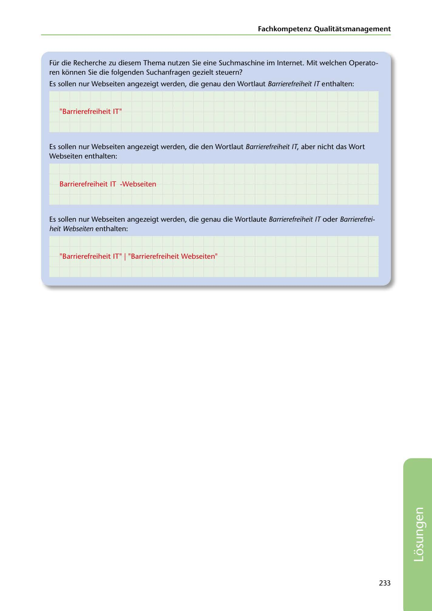

---
## Page 235
---

### Fachkompetenz Qualitatsmanagement

Für die Recherche zu diesem Thema nutzen Sie eine Suchmaschine im Internet. Mit welchen Operato- ren konnen Sie die folgenden Suchanfragen gezielt steuern?

Es sollen nur Webseiten angezeigt werden, die genau den Wortlaut Barrierefreiheit IT enthalten:

"Barrierefreiheit IT"

Es sollen nur Webseiten angezeigt werden, die den Wortlaut Barrierefreiheit IT, aber nicht das Wort Webseiten enthalten:

Barrierefreiheit IT -Webseiten

Es sollen nur Webseiten angezeigt werden, die genau die Wortlaute Barrierefreiheit IT oder Barrierefrei- heit Webseiten enthalten:

"Barrierefreiheit IT" 1 "Barrierefreiheit Webseiten"

233

<!-- IMAGE: page-235-img-1.jpeg - TODO: Add description -->
