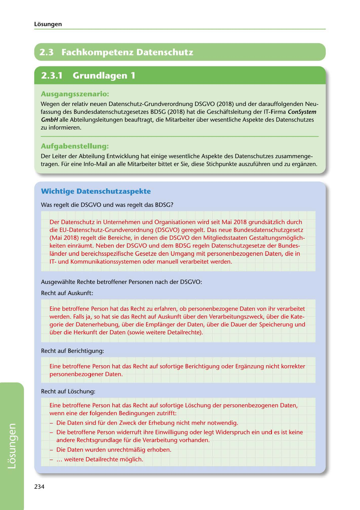

---
## Page 236
---

Losungen

# 2.3 Fachkompetenz Datenschutz

<!-- IMAGE: page-236-img-1.jpeg - TODO: Add description -->

## Ausgangsszenario:

Wegen der relativ neuen Datenschutz-Grundverordnung DSGVO (2018) und der darauffolgenden Neu- fassung des Bundesdatenschutzgesetzes BDSG (2018) hat die Geschaftsleitung der IT-Firma ConSystem

GmbH alle Abteilungsleitungen beauftragt, die Mitarbeiter über wesentliche Aspekte des Datenschutzes zu informieren.

## Aufgabenstellung.

Der Leiter der Abteilung Entwicklung hat einige wesentliche Aspekte des Datenschutzes zusammenge- tragen. Für eine lnfo-Mail an alle Mitarbeiter bittet er Sie, diese Stichpunkte auszuführen und zu erganzen.

## Wichtige Datenschutzaspekte

Was regelt die DSGVO und was regelt das BDSG?

Der Datenschutz in Unternehmen und Organisationen wird seit Mai 2018 grundsatzlich durch die EU-Datenschutz-Grundverordnung (DSGVO) geregelt. Das neue Bundesdatenschutzgesetz (Mai 2018) regelt die Bereiche, in denen die DSGVO den Mitgliedsstaaten Gestaltungsmoglich- keiten einraumt. Neben der DSGVO und dem BDSG regeln Datenschutzgesetze der Bundes- lander und bereichsspezifische Gesetze den Umgang mit personenbezogenen Daten, die in ITund Kommunikationssystemen oder manuell verarbeitet werden.

Ausgewahlte Rechte betroffener Personen nach der DSGVO:

Recht auf Auskunft:

Eine betroffene Person hat das Recht zu erfahren, ob personenbezogene Daten van ihr verarbeitet werden. Falls ja, so hat sie das Recht auf Auskunft über den Verarbeitungszweck, über die Kate- gorie der Datenerhebung, über die Empfanger der Daten, über die Dauer der Speicherung und über die Herkunft der Daten (sowie weitere Detailrechte).

Recht auf Berichtigung:

Eine betroffene Person hat das Recht auf sofortige Berichtigung oder Erganzung nicht korrekter personenbezogener Daten.

Recht auf Loschung:

Eine betroffene Person hat das Recht auf sofortige Loschung der personenbezogenen Daten, wenn eine der folgenden Bedingungen zutrifft:

- Die Daten sind für den Zweck der Erhebung nicht mehr notwendig.

- Die betroffene Person widerruft ihre Einwilligung oder legt Widerspruch ein und es ist keine andere Rechtsgrundlage für die Verarbeitung vorhanden.

- Die Daten wurden unrechtmar..ig erhoben.

- ... weitere Detailrechte moglich.

234

**[VISUAL: CONSYSTEM GMBH SOLUTION HEADER]**
Header image for the ConSystem GmbH data protection (DSGVO/BDSG) solutions section.
